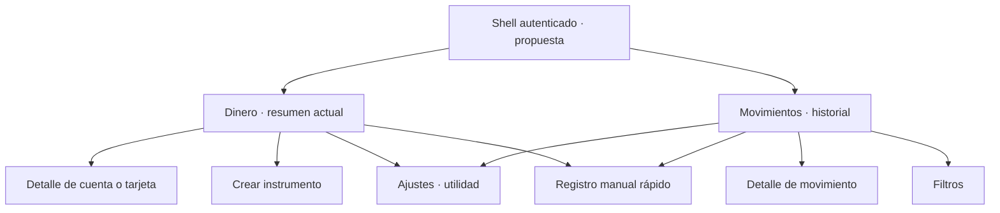

# Kipu — Auditoría integral de UI/UX Android / Jetpack Compose

**Fecha:** 3 de octubre de 2026. **Estado:** diagnóstico y propuestas; implementación pendiente de aprobación.

## 1. Resumen Ejecutivo y Diagnóstico Global

Kipu tiene una base funcional útil: historial local, registro manual, cuentas, tarjetas, referencias financieras y distinción Free/Premium. La experiencia activa presenta problemas importantes de navegación, geometría, comunicación financiera y densidad de formularios. La prioridad es hacer accesibles y comprensibles las operaciones frecuentes; una renovación estética completa no resolvería esos problemas.

### Diagnóstico principal

| Evidencia | Hallazgo | Consecuencia | Mejora relacionada |
| :--- | :--- | :--- | :--- |
| [OBSERVADO] + [CÓDIGO] | La barra inferior del Dashboard coincide con la barra de tres botones de Android en **112 px**, aproximadamente **39,8 dp**. | Parte sustancial de las áreas táctiles está debajo del sistema. | QW-01 |
| [OBSERVADO] + [CÓDIGO] | Inicio y Análisis no llevan a otro destino; el resumen de dinero se alcanza pasando por Ajustes. | Acciones sin respuesta y arquitectura difícil de descubrir. | CE-01 |
| [OBSERVADO] + [CÓDIGO] | Aplicar filtros y Guardar instrumento están al final de contenido largo. | Scroll para encontrar acciones esenciales. | HI-01, HI-04 |
| [OBSERVADO] + [CÓDIGO] | El formulario de tarjeta muestra un error de monto antes de escribir. | Confunde campo pendiente con dato incorrecto. | HI-03 |
| [OBSERVADO] + [CÓDIGO] | Claro: texto de corte con contraste **2,56:1**; Oscuro: chip seleccionado de comercios con **1,71:1**. | Fallos concretos de legibilidad en ambos temas. | QW-03, QW-04 |
| [OBSERVADO] + [CÓDIGO] | “100% conciliado” es literal; el detalle expone `CATEGORY_UNAVAILABLE`; los importes cambian de formato entre lista y detalle. | Comunicación financiera sin respaldo suficiente o sin contexto. | QW-05, QW-06, QW-07 |
| [CÓDIGO] + [DOCUMENTACIÓN] | La pantalla carga todas las transacciones y no presenta paginación; falta el filtro de procedencia reconocido en HU-22. | Brechas de contrato y riesgo de escala, distintos de los problemas visuales. | CE-04, CE-05 |

**Conclusión:** estabilizar primero áreas táctiles, contraste y veracidad del feedback; después filtros/formularios y navegación. Reutilizar el lenguaje visual actual, Inter y los componentes útiles. Añadir motion cuando ayude a entender una transición, sin retrasar la lectura del dinero.

### Clasificación de resultados

| Tipo solicitado | Ejemplos / IDs | Naturaleza de la evidencia |
| :--- | :--- | :--- |
| Bugs visuales | Solapamiento QW-01; iconos QW-02 | Runtime y código |
| Problemas de UX | Acciones sin destino CE-01; vacío de transferencia HI-06 | Runtime y código |
| Inconsistencias del Design System | Roles de color CE-02; tipografía RV-01 | Código, con consecuencias visibles puntuales |
| Arquitectura de información | Dinero detrás de Ajustes CE-01 | Runtime, código y divergencia con mapas |
| Fricción innecesaria | Aplicar al final HI-01; confirmación local HI-07 | Runtime; alternativa propuesta |
| Problemas Light/Dark | Corte Claro QW-03; chip comercio Oscuro QW-04 | Capturas, tokens y cálculo de contraste |
| Problemas de formularios | Error pristine HI-03; preview antes de datos HI-04 | Runtime y código |
| Problemas de filtros | Premium repetido HI-02; sync duplicado QW-09; fuente CE-05 | Runtime/código; brecha funcional documentada |
| Dialogs/sheets | Cierre HI-10; footer HI-01; confirmación financiera debe permanecer | Runtime y reglas P14 |
| Oportunidades de motion | Estado animado MO-01; orientación MO-02; escala cero MO-05 | Código; efectos pendientes de prueba dirigidos |
| Mejoras cosméticas | Gradientes/radios RV-03 | Refinamiento visual, prioridad baja |
| Cambios documentales | Shell, formularios, filtros, tokens | Mapeados por artefacto en sección 14 |

### Fortalezas que deben conservarse

- [OBSERVADO] QuickMovement mantiene Guardar sobre el teclado decimal y diferencia Gasto, Ingreso y Transferencia.
- [OBSERVADO] Los movimientos anulados siguen visibles y su detalle es de lectura; la cuenta de crédito no aumenta el saldo líquido disponible.
- [CÓDIGO] `MoneyText` ya utiliza cifras tabulares y enmascaramiento de privacidad. No hace falta un segundo sistema de formateo.
- [CÓDIGO] Existen guardias de guardado, control de propietario, tokens de duración y tratamiento explícito de movimiento reducido en componentes del historial.
- [DOCUMENTACIÓN] Free conserva registro manual e historia completa; Premium restringe capacidades, no elimina datos.

### Alcance y método

Se recorrió la aplicación instalada, se capturaron pantallas y jerarquías, se inspeccionó Compose, se consultaron UI/UX Pro Max y compose-animations, se contrastaron reglas mediante Obsidian Mind y se realizaron las tres revisiones solicitadas con AGY. Los prototipos se leyeron después de observar el producto.

No se auditó acceso/autenticación ni lectores de pantalla. No se ejecutaron workflows Spec Kit ni se modificó código de aplicación. No se hicieron compras, anulaciones, archivados ni altas financieras. Los cambios temporales de tema y escala de fuente se restauraron. Los borradores usados en formularios no se guardaron.

### Cómo interpretar la evidencia

- **[OBSERVADO]:** comprobado en el dispositivo; una captura estática no acredita una animación completa ni una transacción.
- **[CÓDIGO]:** encontrado en la implementación inspeccionada de `main`.
- **[DOCUMENTACIÓN]:** comportamiento esperado según una fuente identificada.
- **[INFERENCIA]:** hipótesis razonable pendiente de reproducción o investigación.
- **[PROPUESTA]:** solución sugerida; no constituye una decisión de producto aprobada.

No se presentan porcentajes de abandono, velocidades humanas, tasas de error o mejoras de conversión: no fueron medidos. La semejanza con otras fintech sirve como orientación de claridad y ergonomía, no como evidencia de que un diseño deba copiarse.

## 2. Evidencia Runtime en Dispositivo Real

### Entorno y trazabilidad

| Dato | Valor observado |
| :--- | :--- |
| Dispositivo | Samsung SM-A165M |
| Sistema | Android 16, API 36 |
| Resolución / densidad | 1080 × 2340 px / 450 dpi; ancho nominal de 384 dp |
| Navegación del sistema | Tres botones; no se validó modalidad de gestos |
| Aplicación instalada | `com.kipu.app`, versión 0.1.0, versionCode 1, targetSdk 36 |
| Última actualización del paquete | 2026-10-03 08:43:19, según PackageManager |
| Fuente inspeccionada | Rama `main`, commit `9e63572` |
| Dataset visible | Tres movimientos; una cuenta líquida y una tarjeta de crédito en las secciones del Dashboard |
| Estado comercial visible | Free; indicador de 3/4 instrumentos, aunque el copy actual dice cuentas |
| Escalas examinadas | Fuente 1,0 y 1,3; no se validó 2,0 |
| Temas examinados | Claro y Oscuro seleccionados dentro de la aplicación |
| Estado final | Historial, tema Oscuro, escala 1,0 y modo nocturno del sistema activado |

El APK no expone una huella de commit; su equivalencia exacta con `9e63572` **no se puede certificar**. Se relacionan comportamientos observados con fuentes compatibles, manteniendo ambas evidencias separadas.

Artefactos: [metadatos del dispositivo](evidence/device-metadata.txt), [manifiesto de 52 capturas con SHA-256](evidence/capture-manifest.csv), PNG y XML con el mismo nombre base. La fecha del manifiesto corresponde al archivo local de captura, no a un reloj de medición de tareas. Los XML ayudan a medir geometría y estado habilitado; no se evaluaron sus atributos de lectores de pantalla.

### Lectura visual rápida

| Dashboard y barra del sistema | Filtros Free al abrir | Chip de comercios en Oscuro |
| :--- | :--- | :--- |
|  |  |  |

Para repetir la captura se usó ADB del SDK local: `uiautomator dump /sdcard/kipu_audit.xml`, `screencap -p /sdcard/live.png` y `pull` de ambos hacia la carpeta de evidencia. Los taps y swipes se verificaron con una captura posterior; se descartaron intentos cuyo archivo no representaba la pantalla indicada. Las imágenes anteriores son capturas originales, no mockups.

### Journeys reproducidos

| ID / pantalla | Condición y pasos | Resultado [OBSERVADO] | Evidencia / componente |
| :--- | :--- | :--- | :--- |
| E01 · Apertura | Sesión existente; detener y volver a iniciar el paquete sin limpiar datos. | Aterriza en Historial, sin barra inferior de la app. | [Captura](evidence/cold_launch_authenticated.png), [XML](evidence/cold_launch_authenticated.xml); `MainActivity` |
| E02 · Acceso a dinero | Historial → engranaje → scroll en Ajustes → Mi Dinero Real. | El resumen financiero se presenta como pantalla secundaria con Volver y barra inferior propia. | [Ajustes](evidence/settings_navigation_bottom.png), [Dashboard](evidence/accounts_dashboard_dark.png); `AccountsNavigation`, `DashboardScreen` |
| E03 · Barra inferior | Dashboard; pulsar Inicio y Análisis en la franja visible superior del área táctil. | Ambos mantienen Dashboard. Pulsar más abajo en la zona de Análisis devolvió a Ajustes en otro intento. | [Inicio](evidence/dashboard_home_noop.png), [Análisis](evidence/dashboard_analysis_noop.png), [toque inferior](evidence/dashboard_lower_tap_returned_settings.png) |
| E04 · Filtros Free | Historial → icono de filtros; expandir sheet; dos desplazamientos largos hacia arriba por su contenido. | Aplicar/Cancelar aparecen al llegar al final; advertencia Premium y grupos bloqueados ocupan gran parte del recorrido. | [Apertura](evidence/advanced_filters_free_top.png), [expandido](evidence/advanced_filters_free_expanded.png), [final](evidence/advanced_filters_free_bottom.png); `MovementFiltersSheet` |
| E05 · Gasto / teclado | FAB → Gasto → introducir 12,34 en borrador, sin guardar. | Teclado decimal; Guardar permanece visible; cuenta visible y resto de campos requieren scroll. | [Formulario](evidence/quick_movement_expense.png), [IME](evidence/quick_movement_keyboard.png); `QuickMovementScreen` |
| E06 · Ingreso | FAB → Ingreso; esperar y volver a capturar. | Cuenta destino y categoría opcional; “Cargando categorías” permanece en dos capturas con lista vacía. | [Inicial](evidence/quick_movement_income.png), [posterior](evidence/quick_movement_income_settled.png); no demuestra una carga de red bloqueada |
| E07 · Transferencia | Borrador → Transferencia → cuenta destino, teniendo una sola cuenta líquida elegible. | Cero destinos; la cuenta de origen se excluye correctamente. El vacío no explica esa restricción. | [Transferencia](evidence/quick_movement_transfer.png), [destinos](evidence/quick_transfer_destination.png) |
| E08 · Selectores | Gasto → categorías y, por separado, comercio; cerrar sin guardar. | Categorías usa selección y confirmación; comercios lista catálogo bajo “frecuentes”; chip Todos blanco sobre turquesa claro en Oscuro. | [Categorías](evidence/quick_movement_categories.png), [comercio](evidence/quick_merchant_picker.png) |
| E09 · Validación segura | Gasto con monto cero; dos pulsaciones de Guardar. | Sigue en formulario, muestra error de monto; no se confirmó ninguna operación. | [Antes](evidence/quick_validation_before.png), [después](evidence/quick_invalid_amount_double_tap.png); guardia `QuickMovementViewModel` |
| E10 · Alta de instrumento | Dashboard → crear instrumento; recorrer débito; cambiar a crédito; no guardar. | Preview, banco/producto, datos y personalización alargan el recorrido. Línea de crédito muestra error sin interacción; Guardar está abajo. | [Entrada](evidence/instruments_create_type.png), [débito final](evidence/instrument_form_debit_bottom.png), [crédito medio](evidence/instrument_form_credit_middle.png), [crédito final](evidence/instrument_form_credit_bottom.png) |
| E11 · Cuenta / tarjeta | Abrir instrumentos existentes solo en lectura; abrir tasas referenciales. | Crédito muestra deuda, disponible y utilización en detalle, pero no todos en lista; aparece garantía sobre score. Tasas referenciales están separadas de TEA personal. | [Cuenta](evidence/bank_account_detail.png), [crédito](evidence/credit_card_detail_dark.png), [catálogo de tasas](evidence/card_rates_catalog.png) |
| E12 · Claro | Cambiar tema en Ajustes; volver a Historial, Dashboard y filtros. | Iconos del sistema blancos sobre fondo claro; fecha de corte tenue. | [Historial](evidence/history_light.png), [Dashboard](evidence/accounts_dashboard_light.png), [filtros](evidence/advanced_filters_light.png) |
| E13 · Fuente 130% | Fuente 1,3; Historial y QuickMovement con teclado; restaurar a 1,0. | Filas de historial se alargan; chip Transferencia queda fuera del ancho inicial, en una fila desplazable. El formulario conserva CTA; Transferencia usa dos líneas. | [Historial](evidence/history_font_130_light.png), [formulario](evidence/quick_movement_font_130_light.png), [IME](evidence/quick_movement_font_130_keyboard.png) |
| E14 · Búsqueda sin resultados | Introducir texto de prueba sin coincidencias; limpiar. | Vacío con acción Limpiar filtros; copy no diferencia con precisión búsqueda textual. | [Captura](evidence/history_search_empty.png) |
| E15 · Detalle anulado | Abrir movimiento ya anulado; expandir; volver. | Conserva importe, revisiones y lectura; expone motivo técnico. Atrás colapsa inicialmente la sheet, no necesariamente la cierra en ese primer paso. | [Inicial](evidence/voided_movement_detail_light.png), [expandido](evidence/voided_movement_detail_expanded.png), [Atrás](evidence/detail_back_collapsed.png) |
| E16 · Restauración | Cerrar borradores y restituir preferencias temporales. | Historial con los mismos tres movimientos visibles. | [Estado final](evidence/final_history_restored.png), [metadatos](evidence/device-metadata.txt) |

### Geometría comprobada

[OBSERVADO] Un ítem de la barra de Dashboard ocupa `y=2182..2317`; la barra del sistema comienza en `y=2205` y termina en `2340`. Intersección: `2317−2205=112 px`. Con densidad `450/160=2,8125`, son `39,82 dp`. De los aproximadamente 48 dp de ese ítem, quedan alrededor de **8,2 dp por encima** de la zona del sistema.

[CÓDIGO] `KipuBottomBar` es una `Surface`/`Row` propia sin tratamiento local de `navigationBars` en [DashboardScreen](../../app/src/main/java/com/kipu/app/feature/accounts/presentation/dashboard/DashboardScreen.kt#L1668). Esta coincidencia explica el defecto de geometría; la ruta exacta de cada evento interceptado por Android no se instrumentó. El retorno a Ajustes es una observación; atribuirlo a un botón concreto del sistema sigue siendo [INFERENCIA].

### Límites de las pruebas

ADB reproduce coordenadas y recorridos, **no mide la comodidad física del pulgar de una persona**. Las observaciones de alcance con una mano se expresan como inferencias geométricas. No se midió frecuencia de taps fantasma ni abandono.

No se ejecutaron transacciones válidas para probar doble envío, cancelación destructiva o compensación. Tampoco se fabricó una concesión Premium, se alteró el reloj, se forzó expiración de 72 horas, se desconectó la red, se cambió la navegación del sistema o se inyectaron conflictos. Loading/Error/Offline/Premium se separan por cobertura en la sección 11. No se hicieron benchmarks, grabaciones de frame timing, pruebas de rotación o muerte de proceso, ni cobertura exhaustiva de todas las combinaciones de temas/formularios.

## 3. Auditoría de Navegación y Arquitectura de Información

### Estado actual y explicación técnica

[OBSERVADO] No hay navegación inferior en Historial. **Sí existe en Dashboard**, por lo que no sería correcto diagnosticar una ausencia total. Está situada en una pantalla secundaria, muestra Inicio/Movimientos/Mis Cuentas/Análisis y mantiene Mis Cuentas seleccionado.

[CÓDIGO] [MainActivity:237](../../app/src/main/java/com/kipu/app/MainActivity.kt#L237) elige Historial como destino autenticado cuando la selección inicial de plan ya existe. Esta decisión explica el aterrizaje observado; no es consecuencia obligatoria de una regla contable. Se examinó esa decisión de destino, no los flujos de acceso excluidos.

[CÓDIGO] [DashboardScreen:162](../../app/src/main/java/com/kipu/app/feature/accounts/presentation/dashboard/DashboardScreen.kt#L162) define callbacks vacíos por defecto para Inicio y Análisis. [AccountsNavigation](../../app/src/main/java/com/kipu/app/navigation/AccountsNavigation.kt) no los conecta. La selección de Mis Cuentas es fija, en lugar de derivarse del destino del controlador de navegación.

[DOCUMENTACIÓN] El mapa general del prototipo describe Inicio como raíz y navegación entre Inicio, Historial, Calendario, Planificación y Reportes. Esa arquitectura expresa la intención futura, pero no acredita que los cinco módulos estén completos hoy. Los prompts del prototipo son cascarones visuales; sus callbacks simulados no son un contrato de comportamiento válido para el producto activo.

### Propuesta CE-01: shell autenticado con destinos reales

[PROPUESTA] Usar un único contenedor de navegación con **Dinero** y **Movimientos** como destinos implementados. Dinero reutiliza el resumen actual de cuentas, liquidez y tarjetas; no incorpora automáticamente la futura HU-39 ni la analítica de HU-41. Ajustes queda como utilidad accesible desde ambas raíces. Detalles/formularios conservan Atrás; las raíces no necesitan Volver.

El destino inicial **Dinero** se recomienda para mejorar la comprensión al abrir el producto. Es una decisión a aprobar, no una corrección automática de HU. Conservar deep links que abran un movimiento y retornos desde notificaciones; preservar filtros y posición de lista por propietario. Usar destinos y restauración de estado reales, no una segunda selección local de pestañas.

**Alternativa menor:** mantener Historial como inicio, pero darle acceso directo y persistente a Dinero. También elimina el paso por Ajustes. Preferir esta alternativa si investigación con usuarios confirma que registrar/consultar es su tarea inicial predominante; hoy no se dispone de esa investigación.

**No recomendado:** cinco pestañas que abren placeholders, un nuevo Dashboard con gráficos futuros, o dos destinos distintos que repitan exactamente la misma lista de cuentas. Si las futuras HU requieren cinco secciones, ampliar la navegación cuando cada destino tenga capacidad real.

### Ergonomía y pila de navegación

- [INFERENCIA] Engranaje superior más scroll en Ajustes resulta difícil de descubrir para una tarea frecuente; una pestaña inferior permite acceso directo en un toque desde la otra raíz.
- [PROPUESTA] Usar `NavigationBar`/`NavigationBarItem` y coordinar sus insets con `Scaffold`. Comprobar que ningún hijo añade de nuevo el mismo padding.
- [PROPUESTA] Definir comportamiento de Atrás desde utilidad, detalle, sheet y borrador. Una pestaña no debe empujar repetidamente copias de Historial a la pila.
- [CÓDIGO] El registro de destinos de notificaciones está presente en `MainActivity`. La auditoría histórica que reportaba su ausencia no constituye evidencia de un fallo actual; no se reprodujo ese journey aquí.

El tratamiento de insets debe considerar que Android aplica edge-to-edge a aplicaciones con target 35 o superior en las versiones correspondientes. [Guía oficial de insets de Compose](https://developer.android.com/develop/ui/compose/system/insets). La arquitectura debe mantener una pila coherente de destinos y retorno. [Principios oficiales de Navigation](https://developer.android.com/guide/navigation).

## 4. Auditoría de Pantallas Clave

### Dashboard — “Mi Dinero Real”

**[OBSERVADO] Aciertos:** importe disponible visible, distinción entre dinero líquido y tarjetas de crédito, estado Free y acceso a instrumentos. **[CÓDIGO] Acierto contable:** el disponible de la tarjeta no se agrega al saldo líquido.

**[OBSERVADO] Problemas:** el bloque superior ocupa una porción amplia del viewport; crédito aparece después de cuentas y requiere recorrido adicional. La tarjeta de la lista muestra deuda y corte, pero disponible/utilización están en el detalle. La barra inferior está solapada; “100% conciliado” aparece sin explicar qué se concilió.

**[CÓDIGO] QW-05:** ese porcentaje es una cadena literal en [DashboardScreen:1135](../../app/src/main/java/com/kipu/app/feature/accounts/presentation/dashboard/DashboardScreen.kt#L1135), no un cálculo de conciliación. Historial tiene filas “Requiere revisión”. Eso evidencia comunicación sin respaldo; **no prueba por sí solo que revisión, sincronización y conciliación bancaria sean el mismo estado**.

**[PROPUESTA] Jerarquía:** disponible líquido → cuentas → crédito con deuda/disponible/utilización → próximas fechas pertinentes. Reducir espacios y preview decorativo antes de quitar información. Si se introduce patrimonio neto, debe usar el contrato de P22; no renombrar el disponible actual como patrimonio sin calcular pasivos/otros activos correctamente.

**[PROPUESTA] HI-08:** reutilizar la capacidad del [CreditCardSummaryCard existente](../../app/src/main/java/com/kipu/app/feature/accounts/presentation/components/CreditCardSummaryCard.kt), después de verificar su equivalencia con los modelos activos del Dashboard. Mostrar deuda, disponible crediticio, porcentaje utilizado y fecha; no confundirlos con liquidez. Los estados 50/80/100 deben respetar HU-10 y configuración, sin un nuevo umbral comercial inventado.

**[PROPUESTA] QW-08:** “3 de 4 instrumentos”, con desglose al tocar el indicador. [DOCUMENTACIÓN] HU-57 cuenta una cuenta y su débito por separado; efectivo y cuenta interna de crédito no duplican cupo. [CÓDIGO] El repositorio suma cuentas computables y tarjetas. **Dos filas/secciones visibles no prueban un error en el contador 3/4.** Explicar el criterio es mejor que alterar el cálculo por intuición.

### Historial

**[OBSERVADO] Aciertos:** búsqueda visible, chips por tipo, agrupación por fecha, estados de revisión/anulación, FAB al alcance inferior y referencias históricas. **[CÓDIGO]** Chips/acciones principales contemplan 48 dp y existe un espaciador final de 88 dp para el FAB.

**[OBSERVADO] Problemas:** `S/ -100.00` en lista frente a detalle sin dirección; títulos derivados de notas poco informativas; copy de fechas desigual. A 130% las filas crecen y algunos elementos salen del ancho inicial.

**[PROPUESTA] QW-07:** dirección consistente en importe y tipo textual. Un gasto puede representarse como `−S/ 100.00`; un ingreso, `+S/ 100.00`. La ubicación del signo es una convención de producto propuesta, **no una obligación universal bancaria**. Transferencia muestra dirección/cuentas, sin presentarla como gasto neto. Una anulación conserva el importe original y agrega “Sin efecto en saldos”; no sustituir el importe por cero ni esconder la historia.

**[PROPUESTA] RV-01:** adaptar filas a ancho disponible y texto real; mover importe a una segunda línea cuando no quepa, preservar títulos y permitir varias líneas. El código usa `fontScale > 1.3` como corte: en exactamente 1,3 no cambia a esa variante. No basta con aumentar un número mágico; probar restricciones de ancho, localización y alias largos. La fila de chips ya permite scroll horizontal: el recorte inicial de Transferencia no significa pérdida definitiva de la opción.

### QuickMovement

**[OBSERVADO] Aciertos:** monto prominente, cuenta preseleccionada visible, teclado decimal, acción Guardar por tipo y diferencia clara entre origen/destino. Nota ya está plegada: no proponer introducir de nuevo ese comportamiento como si faltara.

**[PROPUESTA] HI-05:** compactar filas de cuenta/categoría/comercio manteniendo información de selección. Comercio permanece visible y opcional en Gasto. Fecha conserva resumen “Hoy” accesible; edición de fecha/nota queda en un nivel secundario. Gasto exige categoría según la regla; Ingreso la conserva opcional; Transferencia no la requiere. No añadir campos obligatorios por estética.

**[OBSERVADO] QW-10:** Ingreso sin categorías sigue mostrando “Cargando categorías” en la recaptura. **[CÓDIGO]** [QuickMovementScreen:583](../../app/src/main/java/com/kipu/app/feature/movements/presentation/QuickMovementScreen.kt#L583) deduce carga de `availableCategories.isEmpty()`. No diferencia vacío de una petición activa. **[PROPUESTA]** modelar Loading/Empty/Error; permitir continuar el ingreso sin categoría y ofrecer una salida local razonable. No exigir reconexión como explicación universal de una lista vacía.

### Cuentas y tarjetas / detalle

**[OBSERVADO]** El detalle de cuenta comienza como edición de presentación más que como resumen operativo. El detalle de crédito privilegia una tarjeta visual grande antes de deuda/disponible. La personalización tiene valor, pero compite con información financiera.

**[PROPUESTA]** Separar resumen operativo de “Editar datos/presentación”; mantener estilo y alias accesibles como acción secundaria. Reducir el preview, sin eliminar privacidad ni identidad del instrumento.

**[OBSERVADO] HI-09:** crédito muestra próxima fecha de pago con deuda cero y el texto “Rango óptimo (< 30% no afecta score)”. **[CÓDIGO]** El texto es literal en [AccountDetailScreen:1341](../../app/src/main/java/com/kipu/app/feature/accounts/presentation/detail/AccountDetailScreen.kt#L1341). No se verificó una obligación de pago real ni una garantía sobre score. **[PROPUESTA]** distinguir “Fecha de pago configurada” de “Pago pendiente” según datos disponibles; describir uso de línea sin garantizar resultados crediticios.

**[OBSERVADO] Tasas:** existe separación entre TEA referencial y personal: conservarla. La pantalla de catálogo expone estado técnico, URL y datos repetidos. **[PROPUESTA]** fecha de consulta/fuente humana, enlace de detalle y advertencia breve de referencia; no ocultar procedencia. No se auditó la exactitud actual de tasas ni se consultó una cotización bancaria: los valores capturados no son una recomendación financiera.

### Filtros

**[OBSERVADO]** El nombre “Filtros avanzados” contiene rango de fechas básico Free y muchos campos deshabilitados. Las acciones finales no aparecen al abrir. **[PROPUESTA]** llamar al contenedor “Filtros”, distinguir Básicos/Avanzados y reorganizar la capacidad disponible; detalle en sección 7.

## 5. Auditoría de Formularios y Progressive Disclosure

### Modelo recomendado de información

| Flujo | Visible inmediatamente [PROPUESTA] | Secundario / progresivo | Regla que se preserva |
| :--- | :--- | :--- | :--- |
| Gasto | Tipo, monto, cuenta, categoría, comercio opcional compacto, Hoy | Nota; edición de fecha/hora | Categoría obligatoria; comerciante no se convierte en obligatorio |
| Ingreso | Tipo, monto, cuenta destino, categoría opcional, Hoy | Nota; edición de fecha/hora | Ingreso manual Free operativo aunque no haya categorías |
| Transferencia | Tipo, monto, origen, destino, Hoy | Nota; contexto de moneda si el contrato lo exige | Dos cuentas distintas y reglas actuales de elegibilidad |
| Cuenta / débito | Tipo, banco, producto cuando corresponda, alias, moneda y saldo inicial | Preview compacto; icono/color; datos opcionales del plástico | No aumentar exposición de datos sensibles |
| Crédito | Tipo, banco/producto, alias, moneda, línea, corte/pago y datos realmente obligatorios | TEA personal con referencia contextual; estilo/preview | TEA personal separada del catálogo; no almacenar CVV |

Este orden no obliga a convertir el formulario en un wizard largo. Primero probar un formulario por secciones con selectores eficientes. Usar pasos separados solo si la elección de producto y la introducción de datos realmente compiten por espacio o necesitan validación independiente.

### Validación

[OBSERVADO] En el alta de crédito la línea vacía se marca inválida. El mensaje de cuatro dígitos también aparece antes de escribir; distinguir si actúa como ayuda o error. [CÓDIGO] `parsedAmount == null` activa error sin estado touched en [UnifiedInstrumentFormScreen](../../app/src/main/java/com/kipu/app/feature/accounts/presentation/instruments/UnifiedInstrumentFormScreen.kt#L761). El botón inactivo resume “completa obligatorios”, pero no guía al primer campo pendiente.

[PROPUESTA] HI-03: ayuda neutral antes de interacción; validar formato tras abandonar campo o intentar guardar; eliminar el error cuando se corrija. Diferenciar **falta por completar** de **valor inválido**. Tras un intento, desplazar y enfocar el primer error pertinente. Evitar cambios de foco por cada tecla y mensajes que salten mientras se escribe un monto parcial.

[CÓDIGO] QuickMovement valida en `onSave`, limpia errores al editar y protege `isSaving` antes de lanzar la operación. La prueba de monto cero confirma feedback de validación, **no idempotencia financiera con un comando válido**. Mantener la guardia y feedback de envío; no declarar arreglado un doble registro que no se reprodujo.

### Selectores, teclado y estado

- **HI-04 [PROPUESTA]:** reemplazar catálogo largo inline por selector buscable cuando el volumen lo justifique; preview compacto y personalización plegada. Los datos obligatorios preceden a decoración.
- **HI-06 [PROPUESTA]:** destino vacío: “Necesitas otra cuenta para transferir. La cuenta de origen no puede ser también destino”. Ofrecer crear otra cuenta cuando el cupo y el dominio lo permitan; volver al mismo borrador.
- **HI-07 [PROPUESTA]:** seleccionar una categoría elegible puede regresar directamente al borrador QuickMovement; reservar confirmación para selección múltiple. Separar el gesto de expandir una raíz del gesto de elegirla. Seleccionar no guarda la operación financiera.
- **CE-06 [CÓDIGO] + [PROPUESTA]:** varios campos del formulario unificado usan `remember`. Revisar pérdida del borrador al recrear la pantalla, sin afirmar que ocurrió en esta sesión. Definir retención por propietario y tipo de instrumento; no almacenar secretos ni datos de otro usuario. `ViewModel`, estado guardable y persistencia de borrador no son mecanismos equivalentes ante muerte de proceso.
- **[OBSERVADO]:** QuickMovement resuelve IME correctamente en las condiciones probadas. **[INFERENCIA]:** otras combinaciones de instrumento/IME/fuente grande pueden ocultar campos; no se probó teclado de todos los formularios.
- **[PROPUESTA]:** footer primario visible cuando el viewport lo permita; títulos compactos, cuerpo desplazable y campo enfocado visible. En altura insuficiente, adaptar a formulario de pantalla completa o footer en flujo. No sumar `imePadding` indiscriminadamente encima de insets ya consumidos por la sheet.

### Sustento de skills

UI/UX Pro Max favorece validación inline tras interacción y jerarquías claras. Se ejecutó el script local solicitado; la consulta combinada `--domain ux --stack jetpack-compose` para fricción móvil no produjo resultados. En este script, elegir stack dirige la búsqueda al stack. Se completaron consultas de dominio por separado y una de stack para motion.

Resultados conservados: [UX formularios](evidence/skill-ux-form.txt), [paletas financieras](evidence/skill-color-fintech.txt), [tipografía](evidence/skill-typography-finance.txt), [estilo dashboard](evidence/skill-style-dashboard.txt), [Compose motion](evidence/skill-compose-motion.txt). Consultas de insets/layout sin coincidencias y recomendaciones centradas en web no se usan como validación nativa.

Consultas útiles ejecutadas: `inline validation progressive disclosure` (ux), `fintech banking trust semantic` (color), `financial dashboard readable numbers` (typography), `financial dashboard minimal hierarchy` (style) y `animation` (stack jetpack-compose). El generador es una base de heurísticas; sus anotaciones de versión no certifican la versión Gradle del proyecto ni sustituyen documentación oficial de Android.

No se adoptan literalmente paletas cripto doradas, cambio de Inter a otra fuente, count-up de balances ni tarjetas analíticas ajenas al alcance. La skill informa decisiones; evidencia runtime y reglas de Kipu las delimitan.

## 6. Popups, Sheets y Filosofía de Confirmación

### Clasificación por efecto

| Acción | Efecto | Interacción recomendada [PROPUESTA] | Precaución |
| :--- | :--- | :--- | :--- |
| Limpiar búsqueda / quitar chip | Cambia consulta o borrador local | Acción inmediata; Undo opcional si aporta recuperación útil | Sin confirmación modal; no altera ledger |
| Elegir cuenta/categoría | Modifica borrador | Volver con selección; confirmar solo selección múltiple o ambigua | Elegir no equivale a guardar |
| Guardar gasto/ingreso/transferencia | Hecho financiero | Validación, resumen contextual y estado de guardado | No añadir un “¿seguro?” genérico a cada registro si el contrato no lo exige |
| Corregir movimiento | Revisión financiera | Antes/después, efecto en cuentas y confirmación conforme a P14 | Compensación atómica, outbox e historial auditable |
| Anular movimiento | Revierte impacto contable | Confirmación explícita: operación, importe, cuentas y efecto | Mantener `VOIDED`; cero DELETE físico; sin Undo que lo reactive |
| Archivar/reactivar instrumento | Cambia operabilidad, puede tener dependencias | Mantener confirmación contextual mientras se verifica contrato | No retirar una guardia por analogía con borrar una nota |
| Consultar detalle / tasas | Lectura | Sheet/pantalla con cierre evidente y Atrás | Sin confirmación para salir salvo edición realmente pendiente |
| Ver Premium | Navegación informativa | Oferta separada del query básico | No comprar ni restaurar automáticamente por tocar un filtro |

[DOCUMENTACIÓN] P14/HU-21 requiere confirmación de anulación, estado `VOIDED` y reversión auditable. La propuesta de Snackbar + Undo se limita a operaciones reversibles de UI. Un deshacer financiero necesitaría otro comando autorizado y otro contrato; no se incorpora a esta auditoría.

### Sheets existentes

[CÓDIGO] Filtros tiene `navigationBarsPadding`; QuickMovement usa `skipPartiallyExpanded=true`. No existe una ausencia universal de insets o tratamiento de teclado en todas las sheets.

[OBSERVADO] Detalle anulado abre parcialmente, exige expansión/scroll para revisar todo y Atrás puede colapsarlo antes de cerrar. Eso es comportamiento de sheet, **no evidencia de que no pueda cerrarse**. HI-10 propone título y Cerrar accesibles arriba, conservando gesto/Atrás y privacidad.

[PROPUESTA] Una sheet corta sirve para elegir o confirmar; un formulario largo puede necesitar presentación completa. Evitar sheets apiladas sin necesidad, limitar altura de listas internas y conservar el contexto del borrador. No sustituir todos los `AlertDialog` por una abstracción nueva: fechas, selección múltiple y confirmación financiera tienen necesidades distintas.

## 7. Sistema de Filtros y Búsqueda — Free vs Premium

### Contrato de capacidad

| Capacidad [DOCUMENTACIÓN] | Free | Premium vigente |
| :--- | :--- | :--- |
| Leer historia completa y abrir detalle propio | Sí | Sí |
| Texto, rango de fechas y tipo Gasto/Ingreso/Transferencia | Sí | Sí |
| Combinación avanzada de cuenta/tarjeta/categoría/comercio/monto/fuente/estado | Alternativa básica; no ejecutar parte restringida | Sí, con validación en dominio |
| Consulta local de datos disponibles | Sí | Sí, mientras la concesión autorice la capacidad |
| Concesión Premium vencida o temporalmente no confiable | Mantener núcleo Free y registros locales | Revalidar para continuar funciones Premium |

Autoridad: Obsidian Mind, `work/active/kipu/Procesos/15-consultar-y-filtrar-historial.md`, y HU-22/HU-58/HU-59 del Product Backlog. Una nueva UI no debe abrir Premium por ocultar/deshabilitar botones; se mantiene la autorización antes del query.

### Hallazgos y solución

**HI-01 [OBSERVADO] + [CÓDIGO]:** header, explicaciones, campos y CTA forman una sola columna desplazable. Al abrir se ve solo parte del formulario. **[PROPUESTA]** header compacto y footer con Aplicar fuera del cuerpo desplazable en altura suficiente; apertura expandida para ese contenido. Elegir Cancelar/Cerrar en header, sin duplicar dos salidas grandes al final. No bloquear la lectura con footer que ocupe demasiado espacio a fuente grande.

**HI-02 [OBSERVADO]:** aviso Premium más explicación de borrador más grupos deshabilitados repite la misma restricción. **[PROPUESTA]** básicos disponibles primero; una tarjeta compacta explica Premium, con “Ver opciones Premium” si se desea explorar. Los controles bloqueados no necesitan llenar el viewport Free, pero siguen siendo descubribles. No convertir el rango de fechas en función de pago por estar dentro de esa sheet.

**QW-09 [OBSERVADO] + [CÓDIGO]:** `PENDING` e `IN_FLIGHT` aparecen con “Pendiente de sincronizar”. **[PROPUESTA]** un criterio visible “Por sincronizar” puede agrupar ambos valores; conservar en dominio su distinción operativa. Estado financiero, estado de sincronización y bloqueo de plan deben ser dimensiones diferentes.

**QW-12 [OBSERVADO]:** sin coincidencias se habla de filtros incluso para texto. **[PROPUESTA]** “No hay movimientos que coincidan con esta búsqueda”; Limpiar búsqueda junto al campo; distinguir de “Aún no registraste movimientos”, que ofrece registrar. Mantener acción de limpiar filtros cuando sí haya criterios.

**[PROPUESTA] Borrador vs aplicado:** Cambiar un selector no ejecuta todavía la consulta. Aplicar muestra cantidad de criterios activos; al bajar a Free, los criterios Premium pueden conservarse pausados sin contar como aplicados: “1 filtro aplicado · 2 Premium pausados”. Revalidar al aplicar aunque se abrió con acceso vigente. Cancelar no elimina la configuración aplicada; reset del borrador no borra movimientos.

**[CÓDIGO] Validaciones existentes:** importes requieren contexto de moneda y orden de rangos; referencias se derivan de las transacciones disponibles. Mantener referencias históricas/archivadas. **[INFERENCIA]** derivarlas solo del dataset cargado dejaría de ser suficiente al introducir paginación; preparar una consulta independiente de opciones o referencias históricas.

### Brechas funcionales separadas del rediseño

- **CE-04 [CÓDIGO]:** [MovementHistoryViewModel:202](../../app/src/main/java/com/kipu/app/feature/movements/presentation/MovementHistoryViewModel.kt#L202) observa todas las transacciones; filtra y agrupa en memoria; `hasMorePages=false` en la UI. Existen contratos y tareas históricas que declaran paginación, pero no se verificó un camino paginado de esta pantalla. **[DOCUMENTACIÓN]** P15 exige cursor estable. **[INFERENCIA]** posible impacto con miles de movimientos; las tres filas actuales no demuestran lentitud. Investigar discrepancia y conectar la capacidad existente antes de crear otro motor de query.
- **CE-05 [DOCUMENTACIÓN] + [CÓDIGO]:** filtro de **fuente/procedencia** aparece en P15/HU-22 y permanece abierto como T110 en el artefacto existente. No se debe inventar una procedencia a partir de cuenta, sync o texto. Confirmar contrato Room/dominio/datos remotos y preservar procedencia desconocida histórica. No se consulta ni modifica producción para el rediseño visual.

## 8. Light Mode vs Dark Mode — Contraste WCAG AA y Tokens

### Método

Se calcularon luminancias sRGB linealizadas y `(Lmayor + 0,05) / (Lmenor + 0,05)` sobre pares nominales opacos del código. En Claro, tres muestras del fondo de captura corroboran `#F7F9FB`. No se calibró el panel físico ni se midió cada píxel suavizado o gradiente. Archivo reproducible de resultados: [contrast-measurements.json](evidence/contrast-measurements.json).

Para texto normal se usa 4,5:1; para texto grande, 3:1. Los controles inactivos tienen excepciones: una etiqueta deshabilitada no se reporta automáticamente como infracción. [Explicación oficial WCAG de contraste mínimo](https://www.w3.org/WAI/WCAG22/Understanding/contrast-minimum.html). Para iconos/identificación de controles activos se considera el criterio de contraste no textual pertinente, sin convertir toda decoración en un control. [WCAG: contraste no textual](https://www.w3.org/WAI/WCAG22/Understanding/non-text-contrast.html).

| Tema / par | Foreground / background | Ratio | Evaluación |
| :--- | :--- | :--- | :--- |
| Claro · texto de corte de tarjeta | `#94A3B8` / `#FFFFFF` | **2,564:1** | Falla para texto normal; QW-03 |
| Claro · iconos blancos del sistema | `#FFFFFF` / `#F7F9FB` | **1,055:1** | Muy baja legibilidad; QW-02. Medición contextual, no texto de app |
| Claro · secundario de KipuUiColors | `#64748B` / `#FFFFFF` | 4,759:1 | Pasa para texto normal |
| Oscuro · secundario | `#94A3B8` / `#131B2E` | 6,692:1 | Pasa |
| Oscuro · chip seleccionado de comercios | `#FFFFFF` / `#80D5CB` | **1,708:1** | Falla para texto normal; QW-04 |
| CTA local · blanco sobre teal | `#FFFFFF` / `#0D6E64` | 6,120:1 | Pasa |
| Chip seleccionado de historial | `#A3FAEF` / `#0F766E` | 4,555:1 | Pasa por poco; no cambiar opacidad sin recalcular |
| Claro · deuda | `#B91C1C` / `#FFFFFF` | 6,470:1 | Pasa |
| Oscuro · deuda | `#FCA5A5` / `#131B2E` | 9,040:1 | Pasa |
| Oscuro · surface / background | `#131B2E` / `#0B1220` | 1,091:1 | Separación tenue; no es por sí sola infracción de texto |
| Oscuro · borde / surface | `#334155` / `#131B2E` | 1,657:1 | Evaluar si es única señal de control; borde decorativo no equivale a texto |

### Claro

[OBSERVADO] Los iconos del sistema quedan blancos al seleccionar Claro dentro de la app. [CÓDIGO] `enableEdgeToEdge()` se ejecuta antes del contenido temático; no se encontró una actualización equivalente ligada al tema de la app en `MainActivity`. **QW-02 [PROPUESTA]:** elegir apariencia de iconos del sistema según la superficie efectiva, incluso cuando la app y el sistema tienen temas distintos. Verificar después de cada cambio de tema y retorno desde sheets.

QW-03 propone usar el rol secundario de Claro, no el gris de Oscuro hardcodeado, para corte/vencimiento. Historial Claro también tiene separación tenue entre cards y fondo: mejorar jerarquía mediante superficie/espaciado antes de añadir sombras fuertes a cada fila.

### Oscuro

[OBSERVADO] La mayor parte del texto del historial, formulario y detalle es legible. Existe un fallo **local** en comercios, no evidencia de que todo el tema oscuro falle.

[CÓDIGO] [MerchantPicker](../../app/src/main/java/com/kipu/app/feature/categories/presentation/components/MerchantPicker.kt#L245) combina `MaterialTheme.colorScheme.primary` con `Color.White`. En Oscuro, primary es `#80D5CB` y su pareja prevista `onPrimary` es oscura. **QW-04 [PROPUESTA]:** usar pares semánticos del esquema, nunca asumir que todo primary necesita blanco.

RV-02 propone revisar agrupación de cards y límites de campos oscuros. Si un borde es la única señal de un control activo, reforzarlo conforme al contraste no textual; no aclarar indiscriminadamente todos los contenedores. El estado seleccionado necesita texto/icono o forma, además de color.

### Fuente grande y tacto

[OBSERVADO] Fuente 130% aumenta altura de filas y divide Transferencia en el selector del formulario. No se reprodujo texto ilegible en ese selector ni pérdida de Guardar. En historial, el FAB puede cubrir temporalmente una acción de una fila; el espaciador final permite desplazarla fuera de esa zona. No se recomienda añadir otro espaciador duplicado.

[CÓDIGO] Existen mínimos de 48 dp en múltiples controles. **QW-01** demuestra que tamaño nominal no garantiza tamaño realmente accesible si hay solapamiento. [PROPUESTA] Medir bounds efectivos y probar fuente 100/130/200%, alias largos, 3 botones y gestos antes de cerrar una futura implementación. La guía de Compose establece targets táctiles mínimos de 48 dp, incluidos casos en que el área interactiva se amplía respecto del dibujo. [Tamaño táctil: documentación oficial de Compose](https://developer.android.com/develop/ui/compose/accessibility/api-defaults). No hay certificación global WCAG de toda la app en este informe.

## 9. Design System, Tipografía e Inconsistencias de Tokens

### Estado real

[CÓDIGO] Kipu tiene un sistema de diseño **parcial**, no solo componentes aislados: `Color.kt`, `Theme.kt`, `Type.kt`, `KipuUiColors`, `MoneyText`, motion y componentes financieros. Su aplicación no es uniforme; coexisten adaptadores privados, colores directos y dos conjuntos de roles.

| Fuente | Ejemplo | Problema / lectura correcta |
| :--- | :--- | :--- |
| `MaterialTheme.colorScheme` | Claro primary `#005C55`, background `#F7F9FB` | Base general existente |
| `rememberKipuColors()` | Claro primary `#0D6E64`, background `#F8FAFC`, surface blanca | Es sensible al tema; no es una paleta estática exclusivamente clara |
| Adaptador privado del Dashboard | Getters derivados de KipuUiColors + colores puntuales | Duplica nombres/decisiones; dificulta saber qué rol usar |
| Colores directos | Corte `#94A3B8`; chip comercio blanco | Combinaciones fuera del contrato semántico causan fallos concretos |
| Tipografía | `titleMedium=18sp`, `titleLarge=16sp` | Mapeo invertido de jerarquía Material |
| Dinero | Inter + `tnum` en MoneyText | Reutilización válida; falta uniformar dirección/contexto |

[DOCUMENTACIÓN] `docs/stitch-design-system.md` propone Inter y roles `title-md` 18 / `title-sm` 16. Esos tamaños no son en sí incorrectos: **la inversión está en asignar el rol pequeño a `titleLarge`**. Otros roles de `Typography` no configurados pueden conservar defaults Material; revisar su uso antes de afirmar que todos usan Inter.

### Arquitectura recomendada CE-02 / CE-03

[PROPUESTA] Un esquema Material para superficies/texto/interacción general y una pequeña extensión financiera para ingreso/deuda/advertencia/sync, con parejas foreground/background por tema. Eliminar adaptadores duplicados por módulo gradualmente. No cambiar marca ni todas las pantallas de una vez.

| Componente propuesto | Responsabilidad concreta | Reutilización / límite |
| :--- | :--- | :--- |
| `KipuCard` | Superficie, borde, forma, espaciado y slots de contenido | Variantes por densidad/rol; no aceptar decenas de flags de negocio |
| `KipuMoneyText` | Moneda, signo/dirección, privacidad y cifras tabulares | Evolucionar o renombrar `MoneyText`; un único formateador; no convertir monedas |
| `KipuFilterChip` | Seleccionado, aplicado, pausado/bloqueado y tamaño táctil | Separar representación de autorización; reutilizar Material |
| `KipuBottomSheet` | Header, cuerpo, footer opcional y adaptación a insets/IME | Patrón por composición; no reemplazar todas las sheets con un DSL rígido |
| `KipuEmptyState` | Vacío inicial, sin coincidencias y acción contextual | Error/Loading distintos; no inventar que vacío es carga |
| Resumen de tarjeta | Deuda, disponible, utilización, fechas pertinentes | Reutilizar `CreditCardSummaryCard` cuando sus contratos encajen |

RV-01 incluye corregir mapa tipográfico y layouts a fuente grande. Definir roles coherentes antes de escoger tamaños nuevos; por ejemplo, título grande mayor que medio y pequeño, con línea/espacio adecuados. Migrar usos que dependían del nombre invertido para evitar agrandar accidentalmente todo. Inter y cifras tabulares permanecen.

**Refinamiento puramente visual RV-03:** armonizar tamaño del preview, gradientes y radios, cuando no compitan con información. Tiene menor prioridad que navegación, errores y legibilidad; no se justifica con “más moderno”.

## 10. Motion, Microinteracciones y Tokens de Animación

### Inventario existente

[CÓDIGO] [KipuMotionTokens](../../app/src/main/java/com/kipu/app/ui/theme/Motion.kt) declara 80/150/250/350/400/500 ms; Feedback=150. Hay duraciones compartidas, pero no roles comunes de easing/desplazamiento. [ReducedMotion](../../app/src/main/java/com/kipu/app/ui/motion/ReducedMotion.kt) observa las tres escalas globales y detecta cero.

| Área | Implementación encontrada [CÓDIGO] | Evaluación |
| :--- | :--- | :--- |
| Aviso Free/Premium/reconexión | AnimatedVisibility + AnimatedContent; entrada 250, salida 150; swap 150/80; salida sin motion reducido | Buena base, evitar reemplazo completo |
| Resumen antes/después | Entrada/salida 250/150; considera motion reducido | Mantener orientación y lectura del impacto |
| QuickMovement | Visibilidad animada de categorías/comercio al cambiar tipo | Útil si no mueve el foco ni cambia los campos elegidos indebidamente |
| Sheet Material | Gestos y animación del componente | No apilar una segunda animación manual sobre su contenedor |
| Giro de tarjeta | Tween literal de 500 ms | Decorativo; valorar simplificación y rol compartido |
| Utilización de crédito | Spring con rebote medio / rigidez baja | Puede sobrepasar visualmente el objetivo; no se reprodujo sobrepaso en runtime con 0% |

Compose integra la escala del sistema en sus animaciones. La ausencia de una llamada explícita al helper en cada pantalla **no prueba que ignore animator scale cero**. Se propone validar el comportamiento completo, no anunciar un fallo global que no se observó.

### Propuestas de motion

| Contexto | Token propuesto | Easing / comportamiento | Valor para el usuario |
| :--- | :--- | :--- | :--- |
| Presión / selección breve | Micro 80 o Quick 150 ms | Respuesta inmediata; sin pulso repetido | Confirma recepción del gesto |
| Entrada de aviso / sección | Fast 250 ms | Entrada `LinearOutSlowIn`, salida `FastOutLinearIn` 150 ms | Relaciona estado anterior con nuevo aviso |
| Cambio de contenido de aviso | 150 entrada / 80 salida | Usar estado destino coherente; reducir desplazamiento | Evita flashes de contenido y color incompatibles |
| Detalle forward / back | 200–250 ms, propuesta específica a validar | Desplazamiento corto y retorno simétrico | Orientación espacial, sin transición larga entre pestañas hermanas |
| Sheet | Motion nativo Material | Mantener gesto/interrupción y dimming propio | Movimiento coherente con arrastre |
| FAB | Estado presionado/habilitado, 80–150 ms | Sin escalado continuo ni movimiento al pulsar Guardar | Feedback sin cambiar área táctil |
| Utilización de crédito | Transición acotada 150–250 ms o directa | Sin overshoot; valor numérico real inmediato | Lectura precisa |

Estas son [PROPUESTA], no duraciones medidas del APK ni tokens ya aprobados. Las duraciones mayores de 350 ms no se eliminan por decreto; deben justificar su función. No hacer count-up de saldos, animar centavos, rebotes financieros o skeletons brillantes prolongados.

### Riesgos específicos de implementación

**MO-01 [CÓDIGO] + [INFERENCIA]:** [MovementAccessCard:60](../../app/src/main/java/com/kipu/app/feature/movements/presentation/MovementAccessCard.kt#L60) calcula `warning` con el contenido externo, mientras AnimatedContent presenta un `target`. Durante una transición, el contenido saliente puede recibir colores del entrante. Derivar pares por el estado animado donde corresponda. El botón principal protege `target == content`, pero la acción secundaria Ver Premium de NO_PURCHASE no usa esa misma condición. Revisar toques durante salida; no se reprodujo una navegación accidental por este caso.

**MO-04 [PROPUESTA]:** cambiar utilización rebotante por una transición acotada si pruebas muestran sobrepaso/confusión; el saldo no anima. **MO-05 [PROPUESTA]:** probar escala cero y reanudar escalas previas al terminar, verificando que la pantalla llegue al estado final y que acciones salientes no sigan activas.

Compose-animations recomienda elegir API según cambio de estado: AnimatedVisibility para presencia, AnimatedContent para sustitución y animateAsState para una propiedad. Es preferible usar esos mecanismos en el ámbito que lee la propiedad, sin animar todo el árbol. [Selector oficial de APIs de animación](https://developer.android.com/develop/ui/compose/animation/choose-api).

## 11. Matriz de Estados — Loading, Empty, Error, Offline, Locked

| Pantalla / estado | Cobertura de esta auditoría | Diagnóstico | Tratamiento recomendado [PROPUESTA] |
| :--- | :--- | :--- | :--- |
| Historial con datos | [OBSERVADO] | Tres filas, incluido anulado e histórico local | Conservar lectura, dirección y estados distintos |
| Historial vacío inicial | [CÓDIGO] / [DOCUMENTACIÓN]; no runtime | No se vació la base para forzarlo | Explicar primer registro, CTA manual; sin upsell como requisito |
| Historial sin coincidencias | [OBSERVADO] | Vacío con limpiar, copy genérico de filtros | Diferenciar búsqueda vs filtros |
| Historial Loading/Error de repositorio | [CÓDIGO]; no fallo inducido | Cobertura runtime insuficiente | Loading de duración real; error con Reintentar y datos locales conservados cuando existan |
| QuickMovement válido/IME | [OBSERVADO] en borrador | CTA accesible y teclado decimal | Preservar esta fortaleza |
| QuickMovement error monto | [OBSERVADO] | Feedback inline tras guardar cero | Traer error a viewport sin perder borrador |
| QuickMovement Saving / éxito | [CÓDIGO]; no operación válida ejecutada | Guardia de envío presente | Botón ocupado/deshabilitado; éxito solo después de confirmación local real |
| Ingreso sin categorías | [OBSERVADO] + [CÓDIGO] | Empty tratado como Loading | Estado vacío explícito; categoría sigue opcional |
| Transferencia sin destino | [OBSERVADO] | Cero opciones sin explicación específica | Restricción explicada, crear segunda cuenta si permitido |
| Instrumento pristine / inválido | [OBSERVADO] + [CÓDIGO] | Se muestra error de monto al inicio | Ayuda primero; error después de interacción |
| Instrumento al límite Free | [DOCUMENTACIÓN]; no se completó otro instrumento | No se probó bloqueo del cuarto/quinto alta | Explicar cupo sin borrar/excluir saldos; no crear objetos para forzar límite |
| Movimiento VOIDED | [OBSERVADO] | Lectura e historial conservados, motivo técnico | Mantener estado, humanizar motivo y efecto financiero |
| Conflicto/revisión de movimiento | [OBSERVADO] etiqueta; [CÓDIGO] manejo | No se provocó un conflicto nuevo | Mensaje accionable y seguro, diferenciar revisión vs sync; detalle no debe exponer enums |
| Free / Premium bloqueado | [OBSERVADO] Free; [CÓDIGO] política | Panel saturado de controles bloqueados | Básicos operativos y una explicación de capacidad |
| Premium verificado | [DOCUMENTACIÓN] / [CÓDIGO]; no grant usado | No se probó combinación habilitada en dispositivo | Misma estructura con secciones activas; revalidar al aplicar |
| Premium expirado / reconexión / retry | [DOCUMENTACIÓN] / [CÓDIGO]; no runtime | No se alteraron reloj/firmas/red | Reconectar para Premium; historia/registro/manual/outbox siguen operativos |
| Offline manual / cola pendiente | [DOCUMENTACIÓN]; no desconexión inducida | Hay indicadores de revisión/sync, pero no prueban modo offline | Diferenciar guardado local de sincronizado; no prometer recepción remota |
| Privacidad / montos enmascarados | [CÓDIGO]; no toggle probado | Componente existente | Mantener máscara en lista, detalle y animaciones sin flashes |
| Tema Claro/Oscuro | [OBSERVADO] ambos | Fallos puntuales distintos | Usar pares semánticos y probar transición de tema |
| Motion reducido | [CÓDIGO]; no escala cero inducida | Helper existente + escala de Compose | Prueba dirigida antes de afirmar cumplimiento integral |

No se recomienda simular éxito, sincronización o verificación Premium desde la capa visual. Los estados deben provenir de hechos del repositorio/política. No confundir `Locked` por plan, archivado funcional y movimiento `VOIDED`.

## 12. Coherencia de Copy y Vocabulario Financiero

| Texto / representación actual | Problema | Propuesta y condición |
| :--- | :--- | :--- |
| “100% conciliado” | [CÓDIGO] literal sin indicador que lo respalde | Quitar hasta definir conciliación y tener evidencia; no reemplazar por otro porcentaje inventado |
| “3 de 4 cuentas vinculadas” | [DOCUMENTACIÓN] cupo incluye más que cuentas | “3 de 4 instrumentos”; desglose correcto |
| `CATEGORY_UNAVAILABLE` | [OBSERVADO] motivo técnico visible | “La categoría original ya no está disponible”, si ese motivo es realmente el que devuelve el contrato |
| “Registro conservado” para distintas revisiones | [CÓDIGO] mapping limitado VOID/REVISE | Traducir operaciones reales a Creado/Corregido/Anulado cuando corresponda; no inferir acciones por posición en la lista |
| “Pendiente de sincronizar” duplicado | [OBSERVADO] dos criterios indistinguibles | Un criterio visual agrupado o etiquetas distintas si hace falta distinguir envío en curso |
| “Comercios frecuentes” | [CÓDIGO] catálogo activo ordenado por nombre, no frecuencia personal | “Comercios del catálogo”; usar “Recientes” solo con datos de uso reales |
| “Cargando categorías” ante lista vacía | [CÓDIGO] Empty equivale a Loading | “No hay categorías de ingreso disponibles”; acción local/contextual y categoría opcional |
| “Rango óptimo (<30% no afecta score)” | [OBSERVADO] garantía no respaldada en esta auditoría | “Usaste X% de tu línea”; umbrales de alertas según configuración, sin garantizar score |
| “Próximo pago” con deuda cero | [OBSERVADO] puede sugerir obligación inexistente | “Fecha de pago configurada”; mostrar importe exigible solo si el modelo lo conoce |
| “Facturado” | [INFERENCIA] podría equiparar deuda total a un estado de cuenta | Verificar si existe saldo facturado; si solo hay deuda corriente, nombrarla como tal |
| `S/ -100.00` / `− S/ 12.34` / detalle unsigned | [OBSERVADO] dirección/formato desigual | Convención única por contexto, transferencia explícita y anulado con efecto cero explicado |
| “Setiembre”, “oct.” y capitalización diversa | [OBSERVADO] formato desigual | Formateo `es-PE` consistente: Hoy/Ayer y fecha legible; “setiembre” es una variante válida, no error lingüístico por sí misma |
| Estado `VIGENTE_VERIFICADO` y URL cruda | [OBSERVADO] internals del catálogo | “Referencia consultada el…” y fuente enlazada; conservar evidencia y límites de TEA referencial |
| “1 fuentes” | [OBSERVADO] plural visible en catálogo | Recursos de plurales: “1 fuente”, “2 fuentes” |

Usar “Guardado en este dispositivo” y “Sincronizado” solo según el estado real. “Requiere revisión” debe abrir una explicación, no actuar como un error genérico permanente. No sumar copy promocional al ledger ni ocultar información necesaria para decidir una operación.

## 13. Revisión Cruzada con AGY

Se realizaron las tres consultas con la CLI `agy`, en modo plan y solicitando revisión textual sin herramientas ni edición. AGY actuó como segundo revisor de los resúmenes proporcionados: **no inspeccionó el Samsung ni ejecutó pruebas independientes**.

| Consulta | Momento / objetivo | Registro completo |
| :--- | :--- | :--- |
| 1 | Tras inventario y pruebas: omisiones de UX, consistencia e interacción | [agy-review-01.txt](evidence/agy-review-01.txt) |
| 2 | Tras primera propuesta: riesgos de diseño y Compose | [agy-review-02.txt](evidence/agy-review-02.txt) |
| 3 | Tras ajustar propuestas: valor operativo vs cosmético | [agy-review-03.txt](evidence/agy-review-03.txt) |

### Acuerdos que se incorporan

- Insets y acciones sin destino preceden al pulido visual; footer fuera del scroll reduce gestos de búsqueda de CTA.
- No mostrar error antes de interacción; explicar transferencia sin otra cuenta.
- Mantener Comercio visible, opcional y compacto. La primera idea de plegarlo junto a Nota se retiró después de revisar su valor identificador.
- Footer **adaptativo**, no fijo sin considerar IME/escala de fuente; evitar que header/CTA dejen sin viewport al campo.
- Contar únicamente filtros realmente aplicados; mostrar por separado criterios Premium pausados.
- No usar Undo para resucitar un movimiento anulado; no añadir analítica futura para completar visualmente Inicio.
- Consolidar tokens gradualmente, reutilizar componentes y evitar animación de saldos.

### Desacuerdos y correcciones del informe respecto de AGY

| Afirmación / consejo de AGY | Evaluación crítica |
| :--- | :--- |
| “Pérdida masiva de conversión”, “toques accidentales recurrentes”, hipótesis de 25% | No hay medición de conversión/frecuencia; se conserva como hipótesis, no resultado |
| Ocultar Comercio causaría más de 60% de registros sin ese dato | Cifra sin evidencia; se rechaza. Se acepta el argumento cualitativo sobre discoverability |
| Footer puede ocupar 45% del viewport | No medido aquí; se adopta validación adaptativa, no esa proporción como hecho |
| `<30%` contradice directamente alertas HU-10 50/80/100 | Son conceptos diferentes. El problema es una garantía sobre score no respaldada, no una equivalencia automática de umbrales |
| El detalle ignora cierre por gestos | No acreditado; Atrás colapsa la sheet y hay mecanismos nativos. Se mejora discoverability sin diagnosticar cierre imposible |
| Adoptar Intrinsic Measurements para resolver todo layout | No se recomienda una solución global de ese coste; usar restricciones y composición adaptable caso por caso |
| Design System no tiene impacto operativo | Se discrepa parcialmente: pares semánticos erróneos causan contraste ilegible real. La consolidación completa puede diferirse; corregir esos pares no es cosmético |
| Diferir paginación porque hoy solo hay tres filas | Se acepta que rendimiento no está medido. P15 sí exige paginación: la brecha contractual no desaparece por dataset pequeño |
| Quitar toda nueva animación | Se conserva motion breve de orientación cuando tenga objetivo verificable; se descartan animaciones ornamentales de cifras y transiciones largas |
| “100% conciliado” sería válido solo con cero revisiones/pendientes | No basta: conciliación, revisión y sync pueden tener significados distintos. Primero definir indicador y contrato; hoy retirar literal sin respaldo |
| ViewModel / rememberSaveable bastan indistintamente para muerte de proceso | No son equivalentes. Definir qué borrador debe restaurarse y mediante qué mecanismo |
| Anular / Undo es un P0 nuevo por implementar | La restricción se conserva. No se identificó un Undo financiero activo que requiera implementar un motor de reversión nuevo |

Los fallos finales del chip de comercios y Empty tratado como Loading se confirmaron al completar el contraste de código/runtime; no se atribuye a AGY haberlos probado o revisado con sus medidas finales.

## 14. Matriz Priorizada de Mejoras

### Criterios

**P0:** bloquea o compromete de forma directa una interacción frecuente. **P1:** alta fricción, comprensión financiera o legibilidad. **P2:** consistencia, robustez y cobertura importante. **P3:** refinamiento o hipótesis que necesita validación previa.

Esfuerzo relativo: XS cambio localizado; S componente; M varios componentes/estados; L flujo o navegación; XL varios contratos/capas. No son días ni compromisos de entrega. Riesgo considera regresión, no gravedad del problema. Skill identifica soporte utilizado: UX = UI/UX Pro Max; CA = compose-animations; OM = consulta de reglas en Obsidian Mind. **Doc Sí** significa actualizar una referencia afectada si se aprueba; **No** significa corrección conforme al contrato ya existente, manteniendo evidencia de revisión.

### Quick Wins

| ID | Mejora | Problema que resuelve | Pantallas | Impacto UX | Esfuerzo | Riesgo | Prioridad | Skill de soporte | Actualiza documentación |
| :--- | :--- | :--- | :--- | :--- | :--- | :--- | :--- | :--- | :--- |
| QW-01 | Corregir insets de barra inferior | 112 px solapados con sistema | Dashboard | Taps accesibles; evita interceptación | S | Medio: doble padding | P0 | UX | No |
| QW-02 | Iconos del sistema según tema efectivo | Blanco sobre Claro | Raíces/sheets | Visibilidad del estado del sistema | S | Medio | P1 | UX | No |
| QW-03 | Rol correcto para corte/vencimiento | Contraste 2,56:1 | Dashboard Claro | Legibilidad financiera | XS | Bajo | P1 | UX/color | No |
| QW-04 | onPrimary para chip de comercios | Contraste 1,71:1 en Oscuro | Comercio | Legibilidad de selección | XS | Bajo | P1 | UX/color | No |
| QW-05 | Retirar porcentaje de conciliación literal | Afirmación sin cálculo | Dashboard | Confianza/comprensión | XS si se retira; M si se calcula | Medio si se inventa semántica | P1 | UX + OM | Sí |
| QW-06 | Humanizar motivos/revisiones | Enums expuestos | Detalle/catálogo | Explica estados y recuperaciones | S | Medio: mapping incorrecto | P1 | UX + OM | Sí |
| QW-07 | Una convención de dinero/dirección | Signos/contextos inconsistentes | Lista/detalle/formularios | Menos errores de interpretación | M | Medio: transferencias/VOID | P1 | UX + OM | Sí |
| QW-08 | Cupo de instrumentos y desglose | “Cuentas” no explica 3/4 | Dashboard | Comprende capacidad Free | S | Bajo | P2 | UX + OM | Sí |
| QW-09 | Un criterio visual de sync sin duplicados | PENDING/IN_FLIGHT iguales | Filtros | Menos ambigüedad | S | Medio: conservar equivalencias | P2 | UX + OM | Sí |
| QW-10 | Separar categorías Empty/Loading | “Cargando” indefinido por vacío | Ingreso | Feedback veraz; operación Free | S | Medio: nuevos estados UI | P1 | UX + OM | Sí |
| QW-11 | “Catálogo” en lugar de “frecuentes”; plurales | Personalización no calculada/copy | Comercios/tasas | Expectativas correctas | XS | Bajo | P2 | UX | No |
| QW-12 | Vacío de búsqueda y limpiar contextual | Copy genérico | Historial | Recuperación fácil | S | Bajo | P2 | UX | No |

### Alto Impacto

| ID | Mejora | Problema que resuelve | Pantallas | Impacto UX | Esfuerzo | Riesgo | Prioridad | Skill de soporte | Actualiza documentación |
| :--- | :--- | :--- | :--- | :--- | :--- | :--- | :--- | :--- | :--- |
| HI-01 | Header/footer adaptativos en filtros | CTA al final de scroll | Filtros | Reduce swipes para aplicar | M | Medio: IME/fuente | P1 | UX | Sí |
| HI-02 | Básicos primero y una explicación Premium | Saturación de controles bloqueados | Filtros Free/Premium | Menos carga cognitiva, Free claro | M | Medio: gate/draft | P1 | UX + OM | Sí |
| HI-03 | Validación tras interacción | Error al abrir formulario | Instrumentos | Menos confusión y guía precisa | M | Medio | P1 | UX | Sí |
| HI-04 | Datos antes de preview/personalización | Alta larga y CTA enterrado | Cuentas/tarjetas | Reduce scroll operativo | L | Medio: conservar selección | P1 | UX | Sí |
| HI-05 | Registro compacto con Comercio visible | Filas sobredimensionadas | QuickMovement | Menos scroll sin ocultar datos útiles | M | Medio: IME | P2 | UX + OM | Sí |
| HI-06 | Explicar destino vacío y regreso al draft | Transferencia sin segunda cuenta | Transferencia/alta | Reduce callejón sin salida | S–M | Medio: cupo/retorno | P1 | UX + OM | Sí |
| HI-07 | Selección simple directa de categoría | Confirmación local adicional | QuickMovement/selectores | Puede ahorrar un toque por selección | M | Medio: raíz vs expansión | P2 | UX | Sí |
| HI-08 | Crédito compacto con datos operativos | Información esencial solo en detalle | Dashboard/crédito | Mejora lectura de deuda/disponible | M | Medio: modelos | P1 | UX + OM | Sí |
| HI-09 | Fechas/score con significado verificable | Garantía y pago ambiguos | Crédito | Reduce interpretación financiera errónea | M | Medio: datos de ciclo | P1 | UX + OM | Sí |
| HI-10 | Cierre/header visible en detalle largo | Cerrar solo al final | Detalle/sheets | Mejor discoverability | S | Bajo | P2 | UX | Sí |

### Refinamiento Visual

No todo lo agrupado aquí es cosmético: RV-01 incluye accesibilidad; se separa de cambios financieros y de navegación.

| ID | Mejora | Problema que resuelve | Pantallas | Impacto UX | Esfuerzo | Riesgo | Prioridad | Skill de soporte | Actualiza documentación |
| :--- | :--- | :--- | :--- | :--- | :--- | :--- | :--- | :--- | :--- |
| RV-01 | Roles tipográficos coherentes y layout adaptable | titleLarge menor y filas largas | Global/historial | Jerarquía y tolerancia a fuente grande | M | Medio: usos existentes | P2 | UX/typography | Sí |
| RV-02 | Separación puntual de superficies/control | Dark tenue en ciertos límites | Global Oscuro | Jerarquía; contraste de control si aplica | S | Bajo | P3; P1 si control falla | UX/color | Sí |
| RV-03 | Armonizar previews/gradientes/radios | Variación decorativa | Instrumentos | Principalmente cosmético | S | Bajo | P3 | UX/style | Sí |

### Cambios Estructurales

| ID | Mejora | Problema que resuelve | Pantallas | Impacto UX | Esfuerzo | Riesgo | Prioridad | Skill de soporte | Actualiza documentación |
| :--- | :--- | :--- | :--- | :--- | :--- | :--- | :--- | :--- | :--- |
| CE-01 | Shell real Dinero/Movimientos; Ajustes utilidad | Destinos muertos y dinero anidado | Navegación global | Acceso directo; modelo mental estable | L | Alto: pila/deep links | P1 | UX + OM | Sí |
| CE-02 | Roles Material + extensión financiera gradual | Dos paletas y adaptadores | Global | Previene fallos como chip/corte | L incremental | Medio | P2 | UX/color | Sí |
| CE-03 | Componentes base sobre los existentes | Duplicación de money/cards/sheets | Global | Consistencia y menos regresiones | L incremental | Medio: abstracción excesiva | P2 | UX + CA | Sí |
| CE-04 | Resolver UI paginada y medir dataset amplio | Contrato P15 vs carga total | Historial | Robustez; rendimiento aún no medido | M–L | Alto: cursores/refresco | P2, brecha contractual | UX + OM | Sí |
| CE-05 | Procedencia canónica y selector de fuente | HU-22/T110 incompleto | Filtros/datos | Completa capacidad requerida | L–XL tras contrato | Alto: atribución histórica | P1, dependiente de contrato | OM + UX | Sí |
| CE-06 | Política de retención del borrador | remember no demuestra restauración | Instrumentos/selectores | Evita pérdida al recrear flujo | M | Medio: aislamiento/privacidad | P2 | UX | Sí |

### Motion

| ID | Mejora | Problema que resuelve | Pantallas | Impacto UX | Esfuerzo | Riesgo | Prioridad | Skill de soporte | Actualiza documentación |
| :--- | :--- | :--- | :--- | :--- | :--- | :--- | :--- | :--- | :--- |
| MO-01 | Colores por target y guardias en salida | Posible inconsistencia durante transición | Avisos de acceso | Coherencia; evita acción obsoleta | S | Bajo–Medio | P2 | CA | No |
| MO-02 | Transición corta de destinos relacionados | Orientación no unificada | Navegación | Orientación; validar utilidad | S–M tras CE-01 | Medio: doble animación | P3 | CA | Sí |
| MO-03 | Roles de duración/easing; sheet nativa | Motion disperso o duplicado | Sheets/FAB/avisos | Coherencia con interacción | S incremental | Bajo | P3 | CA | Sí |
| MO-04 | Progreso acotado / giro opcional | Rebote potencial y decoración larga | Crédito | Precisión; pulido secundario | S | Bajo | P3 | CA | Sí |
| MO-05 | Validación integral con escala cero | Cumplimiento no probado en todos los flujos | Global | Respeta preferencia del sistema | S–M de verificación futura | Bajo | P2 | CA | No |

### Documentos y diagramas que requieren actualización si se aprueba

| Cambio | Artefactos afectados | Qué actualizar |
| :--- | :--- | :--- |
| CE-01 | Vault: `work/active/kipu/Prototipo/P1/Esquema de pantallas generales.md`, `Esquema de pantallas relacionadas con las HU.md`, `Descripción de Pantallas según Historias de Usuario.md`, `Stich Prompts.md`; [catálogo local](../references/stitch-redesign-catalog.md) | Raíces, destino inicial, barra con destinos efectivamente construidos, Ajustes y retornos. Diferenciar resumen actual de Inicio futuro |
| QW-05/07/08, HI-08/09 | Vault: HU-04/HU-09/HU-10/HU-57 y P22; [UI cuentas](../../specs/002-ep-cta-cuentas-tarjetas/contracts/ui-contract.md) | Significado de indicadores, etiquetas de cupo, contexto monetario, resumen crediticio. No cambiar fórmulas/alertas por diseño |
| HI-01/02, QW-09/12, CE-04/05 | Vault: HU-22/P15; [UI movimientos](../../specs/004-ep-mov-movimientos-ledger/contracts/ui-contract.md), [contrato de acceso](../../specs/012-ep-pla-planes-monetizacion/contracts/feature-access-policy.md) | Básicos/avanzados, borrador/aplicado/pausado, navegación del panel y fuente/paginación. Mantener gate en dominio |
| HI-03/04/05/06/07/10, CE-06 | Vault: descripciones de Pantallas 4–7/10–11 y prompts correspondientes; contratos UI de EP-CTA/EP-MOV y [EP-CCO](../../specs/003-ep-cco-categorias-comercios/contracts/ui-contract.md) | Jerarquía de formulario, selección, validación y retención/cierre. No convertir campos opcionales en obligatorios |
| CE-02/03, RV-01/02/03, MO-02/03/04 | [Design system](../../stitch-design-system.md), catálogo visual y prompts de las pantallas afectadas | Roles por tema, tipografía, componentes, motion y variantes de viewport |
| Confirmación / conexiones entre journeys | Vault: `Procesos/14-corregir-o-anular-movimiento.md`, `15-consultar-y-filtrar-historial.md`, `22-consultar-situacion-y-analitica-financiera.md`, diagramas correspondientes si representan las rutas afectadas | Cambiar interacción/navegación cuando proceda, conservando compensación contable, autorización y reglas financieras |

La tabla identifica qué revisar y dónde documentar la nueva fuente de verdad. No afirma que todas las HU deban modificarse: si solo cambia representación, bastan contratos de UI y mapas. Los artefactos Spec Kit se citan por trazabilidad; **no se ejecuta ni se inicia su workflow en esta auditoría**.

### Discrepancias y autoridad recomendada

| Documentación vs implementación vs runtime | Decisión propuesta |
| :--- | :--- |
| Prototipo espera cinco raíces e Inicio; código abre Historial y solo Dashboard tiene barra | Aprobar arquitectura de destinos reales; actualizar mapa visual. No forzar cinco placeholders |
| Design system exige contraste; código mezcla foreground fijo y primary temático; runtime falla en Claro/Oscuro | Mantener principio de contraste y corregir pares; esquema semántico reconciliado se vuelve referencia |
| P15 prevé fuente/cursor; tareas anteriores declaran paginación, UI sigue carga total y T110 abierto | Registrar brecha real; contratos de negocio no se degradan para justificar el estado actual |
| Auditoría histórica reporta falta de grafo de notificaciones; código actual lo registra | Usar evidencia actual; no reciclar el fallo antiguo como resultado de esta auditoría |
| Copy “cuentas” parece 3/4 ante dos filas; HU-57/repositorio cuentan instrumentos | Mantener regla de conteo y mejorar explicación; no declarar contador incorrecto por número de filas |

## 15. Roadmap de Implementación Recomendado — Fases A a E

Esta secuencia es una recomendación para **después de aprobación**. No hay implementación ni modificación de contratos en este entregable.

### Fase A — Interacción segura, legibilidad y feedback veraz

**Objetivo:** que las acciones frecuentes se puedan tocar y los mensajes financieros tengan respaldo.

**Alcance:** QW-01/02/03/04/05/06/07/10; completar copy localizado QW-08/09/11/12 cuando no tenga dependencias nuevas. Primero insets de Dashboard; luego iconos de tema y pares de contraste; después el porcentaje literal y estados técnicos. Acordar el significado de cada indicador antes de derivarlo de sync/revisión.

**Aceptación futura:** intersección de targets con barra del sistema de 0 px en 3 botones y gestos; target útil mínimo 48 dp; texto normal activo ≥4,5:1 en ambos temas; ninguna garantía de conciliación/score sin contrato; ningún enum de error crudo visible; Empty no se presenta como petición activa.

### Fase B — Filtros y formularios con menos fricción

**Objetivo:** exponer primero datos y capacidades útiles, con CTA y validación comprensibles.

**Alcance:** HI-01/02/03/04/05/06/07/10 y CE-06. Conservar nota ya plegada, teclado decimal y guardia de envío existentes. Mantener Comercio visible; revisar equivalencia del borrador al cambiar tipo. Diseñar variantes de altura antes de fijar footer universal.

**Aceptación futura:** Aplicar visible sin swipes al abrir el panel Free en el viewport probado; campos obligatorios antes de decoración; cero errores de campo en estado pristine; primer error localizable tras submit; otra cuenta explicada cuando no hay destino; borrador retenido al ir/volver de selector; Free puede seguir consultando y registrando.

**Dependencia funcional paralela:** CE-05 requiere contrato canónico de fuente antes de implementar selector. CE-04 requiere contrastar caminos de query y medir volumen. No bloquear las mejoras de geometría por esperar esos contratos ni dar HU-22 por completa sin resolverlos.

### Fase C — Navegación principal y comprensión del dinero

**Objetivo:** acceder a saldo e historial directamente, sin destinos vacíos.

**Alcance:** CE-01, HI-08/09. Aprobar nombre y destino inicial; documentar diferencias con Inicio HU-39/Reportes HU-41 futuros. Centralizar barra real con estado derivado de ruta, conservar Ajustes y deep links. Crédito distingue disponible de liquidez y fechas configuradas de obligaciones conocidas.

**Aceptación futura:** Dinero e Historial accesibles en un toque desde la otra raíz; cero pestañas con callbacks vacíos; volver desde Ajustes al origen sin reiniciar filtros; selección correcta por ruta; navegación no duplica destinos; ninguna nueva fórmula de patrimonio o alerta sin autoridad.

### Fase D — Consolidación gradual del Design System

**Objetivo:** evitar que una pantalla repita los mismos errores de color, tipografía y formato.

**Alcance:** CE-02/03, RV-01; RV-02 solo donde mejore comprensión o control; RV-03 después de lo funcional. Migrar por componente y pantalla, manteniendo Inter, privacidad y cifras tabulares. Reutilizar `MoneyText` y resumen crediticio en vez de duplicarlos.

**Aceptación futura:** roles tipográficos coherentes; mismos pares semánticos para estados equivalentes; money consistente en lista/detalle/registro; fuente 100/130/200% sin pérdida de información financiera esencial. Revisar texto con alias largos y moneda, no solo capturas de datos cortos.

### Fase E — Motion intencional y verificación de journeys

**Objetivo:** mantener orientación/feedback, sin convertir balances en animaciones decorativas.

**Alcance:** MO-01/05 primero; MO-02/03/04 cuando exista una función concreta. Usar motion nativo de sheets y evitar duplicación de transiciones. La verificación de fases anteriores se hace a medida que se entregan, no se posterga toda hasta E.

**Aceptación futura:** estado destino y colores coherentes durante transición; ninguna acción saliente operativa indebidamente; saldo real disponible inmediatamente; escala cero produce estado final estable; entradas/salidas no desplazan un campo bajo el teclado. Medir frames únicamente si aparece jank o se cambia una animación costosa.

### Métricas de evaluación sin resultados inventados

| Medida | Línea base de esta auditoría | Objetivo propuesto |
| :--- | :--- | :--- |
| Solapamiento de un target de barra | 112 px | 0 px |
| Acceso a Dinero desde Historial | Engranaje → scroll → fila de Ajustes | Un toque de navegación principal |
| Encontrar Aplicar en filtros Free | Expandir + dos swipes largos en el recorrido capturado | Sin scroll para localizar CTA en condiciones equivalentes |
| Contraste corte Claro / chip comercio Oscuro | 2,564:1 / 1,708:1 | ≥4,5:1 para esos textos |
| Error de monto antes de escribir en crédito | Presente | Ausente hasta interacción/submit |
| Callbacks sin destino de Inicio/Análisis | Dos en la barra actual | Ninguno en navegación publicada |
| Formato de dinero | Tres variantes observadas | Una convención contextual verificada |
| Categorías vacías como “Cargando” | Presente en Ingreso | Loading/Empty/Error distintos |
| Tiempo de alta / tasa de error / abandono | No medidos | Medir con tareas y usuarios de prueba; no asignar mejora porcentual anticipada |
| Rendimiento con historial amplio | No medido en este dataset | Dataset aislado, cursor estable y medición explícita conforme al contrato P15 |

### Fuentes de verdad consultadas

Obsidian Mind se consultó mediante `om.search`, `om.recall` y `om.expand`; para secciones largas se leyeron las notas recuperadas. Las referencias de negocio principales son:

- `work/active/kipu/Kipu md/02_Kipu_V4.2_Product_Backlog.md`: HU-04/07/08/09/10/11/18/20/21/22/57/58/59; las referencias futuras HU-39/41 delimitan lo que no debe añadirse sin alcance aprobado.
- `work/active/kipu/Procesos/14-corregir-o-anular-movimiento.md`: revisión/anulación y conservación de historia.
- `work/active/kipu/Procesos/15-consultar-y-filtrar-historial.md`: básicos Free, combinaciones Premium, historia completa y paginación.
- `work/active/kipu/Procesos/22-consultar-situacion-y-analitica-financiera.md`: interpretación y composición de situación financiera.
- `work/active/kipu/Prototipo/P1/`: mapas, descripción de pantallas y `Stich Prompts.md`, utilizados como referencias de intención después del runtime.
- [Design system local](../../stitch-design-system.md), [catálogo visual](../references/stitch-redesign-catalog.md), contratos UI citados y [auditoría anterior](../../audits/KIPU_FULL_FUNCTIONAL_UX_AUDIT.md), esta última solo como antecedente.

**Cierre:** el entregable termina en este informe y sus evidencias. Las decisiones estructurales, de contratos o de representación quedan propuestas para aprobación; no se declara cerrado Sprint 4 ni implementado el roadmap.
