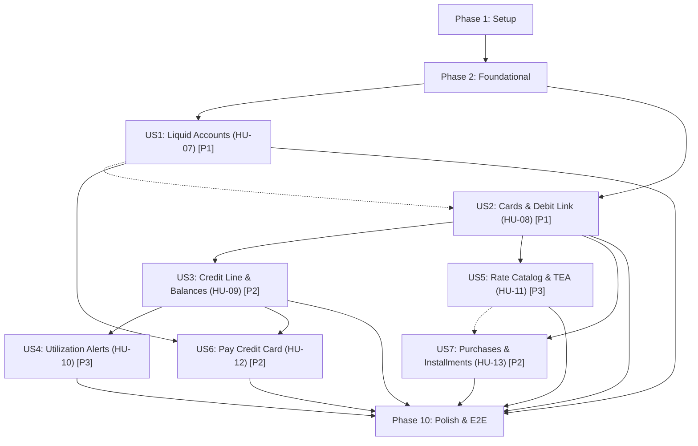

# Implementation Tasks: EP-CTA - Cuentas y Tarjetas

**Feature Branch**: `002-ep-cta-cuentas-tarjetas`  
**Date**: 2026-09-22  
**Spec**: [spec.md](spec.md) | **Plan**: [plan.md](plan.md) | **Data Model**: [data-model.md](data-model.md)

## Phase 1: Setup (Shared Infrastructure)

**Purpose**: Project initialization, baseline recovery, and shared configuration

- [X] T001 Recover and verify Supabase financial baseline migrations in `supabase/migrations/`
- [X] T002 [P] Configure Room schema export location and test dependencies in `app/build.gradle.kts`
- [X] T003 [P] Setup design system tokens and typography helpers for Andean Modernist in `app/src/main/java/com/kipu/app/ui/theme/Type.kt`

---

## Phase 2: Foundational (Blocking Prerequisites)

**Purpose**: Core infrastructure and pure financial models that MUST be complete before ANY user story can be implemented

**⚠️ CRITICAL**: No user story work can begin until this phase is complete

- [X] T004 Implement pure financial domain models (`Money`, `Currency`, `FinancialIds`) in `app/src/main/java/com/kipu/app/core/finance/domain/model/Money.kt`
- [X] T005 [P] Implement `Movement` domain models and enum kinds in `app/src/main/java/com/kipu/app/core/finance/domain/model/Movement.kt`
- [X] T006 [P] Implement `MoneyText` Compose component with masking and tabular numbers in `app/src/main/java/com/kipu/app/ui/component/MoneyText.kt`
- [X] T007 [P] Implement `MaskedCardReference` Compose component with PAN/CVV isolation in `app/src/main/java/com/kipu/app/ui/component/MaskedCardReference.kt`
- [X] T008 Implement `RoomMigrations` for Room v2 to v3 in `app/src/main/java/com/kipu/app/core/database/RoomMigrations.kt`
- [X] T009 Update `KipuDatabase` and converters for Room v3 in `app/src/main/java/com/kipu/app/core/database/KipuDatabase.kt`
- [X] T010 [P] Implement `PendingChangesSource` multibinding in `app/src/main/java/com/kipu/app/core/session/PendingChangesSource.kt`
- [X] T011 [P] Create PostgreSQL baseline migration and RLS helper functions in `supabase/migrations/20260921000000_ep_cta_baseline.sql`
- [X] T012 Implement `InstrumentSyncOutboxEntity` and `InstrumentSyncDao` in `app/src/main/java/com/kipu/app/feature/accounts/data/local/InstrumentSyncDao.kt`
- [X] T013 Implement `SyncInstrumentCommandsWorker` and `InstrumentSyncScheduler` in `app/src/main/java/com/kipu/app/feature/accounts/data/sync/SyncInstrumentCommandsWorker.kt`
- [X] T014 Implement `FinancialInstrumentsApi` and DTO mappers in `app/src/main/java/com/kipu/app/feature/accounts/data/remote/FinancialInstrumentsApi.kt`

**Checkpoint**: Foundation ready — user story implementation can now begin in parallel

---

## Phase 3: User Story 1 - HU-07 Administrar activos liquidos (Priority: P1) 🎯 MVP

**Goal**: Create, view, edit visual presentation, and archive liquid accounts (cash, savings, bank, digital wallets) with atomic opening movements, Free plan quota enforcement, and local-first sync.

**Independent Test**: Create accounts of each type and currency, verify opening movements, edit appearance without changing balances, archive an account, and confirm balances reproduce offline and after restart.

### Tests for User Story 1

- [X] T015 [P] [US1] Unit tests for `CreateLiquidAccount`, `RecordOpeningAdjustment`, and Free quota in `app/src/test/java/com/kipu/app/feature/accounts/domain/CreateLiquidAccountTest.kt`
- [X] T016 [P] [US1] Instrumented tests for `AccountDao` and `FinancialMovementDao` atomic transactions in `app/src/androidTest/java/com/kipu/app/feature/accounts/AccountDaoTest.kt`

### Implementation for User Story 1

- [X] T017 [P] [US1] Create `Account` domain model and preset definitions in `app/src/main/java/com/kipu/app/feature/accounts/domain/model/Account.kt`
- [X] T018 [P] [US1] Implement `AccountEntity` and `FinancialMovementEntity` in `app/src/main/java/com/kipu/app/feature/accounts/data/local/AccountEntity.kt`
- [X] T019 [US1] Implement `AccountDao` and `FinancialMovementDao` with atomic opening transactions in `app/src/main/java/com/kipu/app/feature/accounts/data/local/AccountDao.kt`
- [X] T020 [US1] Implement `FinancialInstrumentsRepository` account operations in `app/src/main/java/com/kipu/app/feature/accounts/data/OfflineFirstFinancialInstrumentsRepository.kt`
- [X] T021 [P] [US1] Implement Use Cases `CreateLiquidAccount`, `RecordOpeningAdjustment`, `ArchiveInstrument`, and `ReactivateInstrument` in `app/src/main/java/com/kipu/app/feature/accounts/domain/usecase/AccountUseCases.kt`
- [X] T022 [P] [US1] Implement `ObserveFinancialDashboard` and `ObserveInstruments` use cases in `app/src/main/java/com/kipu/app/feature/accounts/domain/usecase/ObserveInstrumentsUseCases.kt`
- [X] T023 [US1] Implement `AccountsViewModel` and UI state for Dashboard and Accounts management in `app/src/main/java/com/kipu/app/feature/accounts/presentation/AccountsViewModel.kt`
- [X] T024 [P] [US1] Implement Account form and preset selection in `app/src/main/java/com/kipu/app/feature/accounts/presentation/instruments/AccountFormScreen.kt`
- [X] T025 [US1] Implement Dashboard Pantalla 4 real money view in `app/src/main/java/com/kipu/app/feature/accounts/presentation/dashboard/DashboardScreen.kt`
- [X] T026 [US1] Implement PostgreSQL RPC `create_liquid_account_v1` and `record_opening_adjustment_v1` in `supabase/migrations/20260921000001_accounts_rpc.sql`
- [X] T027 [P] [US1] pgTAP test suite for account creation, adjustment, and RLS isolation in `supabase/tests/database/financial_accounts.test.sql`

**Checkpoint**: At this point, User Story 1 (Liquid Accounts) is fully functional and testable independently as an MVP.

---

## Phase 4: User Story 2 - HU-08 Registrar y vincular tarjetas (Priority: P1)

**Goal**: Register debit and credit cards with secure identification (no full PAN/CVV), link debit cards to liquid savings accounts without duplicating balances, and warn on duplicate visible identities.

**Independent Test**: Register a linked debit card, a credit card, and test prohibited PAN/CVV inputs. Verify debit mirrors account balance, credit does not increase cash, and Free quota counts two slots for debit+account.

### Tests for User Story 2

- [X] T028 [P] [US2] Unit tests for `RegisterDebitCard`, `RegisterCreditCard`, and PAN/CVV validation in `app/src/test/java/com/kipu/app/feature/accounts/domain/RegisterCardTest.kt`
- [X] T029 [P] [US2] Instrumented tests for `CardDao` linking and duplicate detection in `app/src/androidTest/java/com/kipu/app/feature/accounts/CardDaoTest.kt`

### Implementation for User Story 2

- [X] T030 [P] [US2] Create sealed `Card` (`DebitCard`, `CreditCard`) domain models in `app/src/main/java/com/kipu/app/feature/accounts/domain/model/Card.kt`
- [X] T031 [P] [US2] Implement `CardEntity` with debit FK and masked identification constraints in `app/src/main/java/com/kipu/app/feature/accounts/data/local/CardEntity.kt`
- [X] T032 [US2] Implement `CardDao` with linking verification and collision queries in `app/src/main/java/com/kipu/app/feature/accounts/data/local/CardDao.kt`
- [X] T033 [US2] Implement `RegisterDebitCard`, `RegisterCreditCard`, and `DeleteUnusedCard` in `app/src/main/java/com/kipu/app/feature/accounts/domain/usecase/CardUseCases.kt`
- [X] T034 [US2] Extend `OfflineFirstFinancialInstrumentsRepository` with card registration and linking in `app/src/main/java/com/kipu/app/feature/accounts/data/OfflineFirstFinancialInstrumentsRepository.kt`
- [X] T035 [P] [US2] Implement Card registration form with strict 4-digit input and duplicate warning in `app/src/main/java/com/kipu/app/feature/accounts/presentation/instruments/CardFormScreen.kt`
- [X] T036 [US2] Integrate debit card reference under liquid account in Dashboard in `app/src/main/java/com/kipu/app/feature/accounts/presentation/dashboard/DashboardScreen.kt`
- [X] T037 [US2] Implement PostgreSQL RPC `register_card_v1` and card RLS in `supabase/migrations/20260921000002_cards_rpc.sql`
- [X] T038 [P] [US2] pgTAP test suite for debit linking, credit isolation, and PAN/CVV omission in `supabase/tests/database/financial_cards.test.sql`

**Checkpoint**: At this point, User Stories 1 AND 2 (Sprint 2 Delivery Increment) work together and are independently testable.

---

## Phase 5: User Story 3 - HU-09 Consultar linea y saldos de credito (Priority: P2)

**Goal**: View credit card authorized line, debt (used credit), available credit, and utilization percentage, with short month date adjustments.

**Independent Test**: Verify metrics with positive limit, zero limit, debt exceeding limit, and cut-off/due dates on days 29-31 across February and leap years.

### Tests for User Story 3

- [X] T039 [P] [US3] Unit tests for credit metrics and short-month calendar adjustment in `app/src/test/java/com/kipu/app/feature/accounts/domain/CreditMetricsTest.kt`

### Implementation for User Story 3

- [X] T040 [P] [US3] Implement credit metric calculation and date adjustment utilities in `app/src/main/java/com/kipu/app/core/finance/domain/CreditCalculations.kt`
- [X] T041 [US3] Implement `ObserveCreditCardSummary` use case in `app/src/main/java/com/kipu/app/feature/accounts/domain/usecase/ObserveCreditCardSummary.kt`
- [X] T042 [US3] Implement Credit Card summary card with separate used/available/limit display in `app/src/main/java/com/kipu/app/feature/accounts/presentation/components/CreditCardSummaryCard.kt`
- [X] T043 [US3] Integrate credit section with non-cash warning into Dashboard in `app/src/main/java/com/kipu/app/feature/accounts/presentation/dashboard/DashboardScreen.kt`

**Checkpoint**: Credit metrics and limits are clearly displayed and separated from cash assets.

---

## Phase 6: User Story 4 - HU-10 Recibir alertas de utilizacion (Priority: P3)

**Goal**: Monitor credit card utilization crossings (50%, 80%, 100%), deduplicate alerts, re-arm upon drops, and render internal warnings.

**Independent Test**: Test ascending threshold crosses, multiple threshold jumps in one transaction, deduplication while staying above threshold, and re-arming after drop.

### Tests for User Story 4

- [X] T044 [P] [US4] Unit tests for threshold crossing, deduplication, and re-arming in `app/src/test/java/com/kipu/app/feature/accounts/domain/UtilizationAlertsTest.kt`

### Implementation for User Story 4

- [X] T045 [P] [US4] Implement `ThresholdState` domain entity in `app/src/main/java/com/kipu/app/feature/accounts/domain/model/ThresholdState.kt`
- [X] T046 [US4] Implement `CheckUtilizationThresholds` use case in `app/src/main/java/com/kipu/app/feature/accounts/domain/usecase/CheckUtilizationThresholds.kt`
- [X] T047 [US4] Implement internal alert banner and in-app notification component in `app/src/main/java/com/kipu/app/feature/accounts/presentation/components/UtilizationAlertBanner.kt`
- [X] T048 [US4] Display active threshold alerts on Dashboard and Credit Card details in `app/src/main/java/com/kipu/app/feature/accounts/presentation/dashboard/DashboardScreen.kt`

**Checkpoint**: Credit utilization threshold alerts trigger, deduplicate, and re-arm reliably.

---

## Phase 7: User Story 5 - HU-11 Consultar catalogo y registrar TEA (Priority: P3)

**Goal**: View Peruvian bank referential interest rate catalog with disclaimers and verification dates, and manage personal TEA for credit cards without rewriting historical data.

**Independent Test**: Consult active and outdated catalog rates, verify disclaimers, save personal TEA, and verify historical simulations remain unchanged.

### Tests for User Story 5

- [X] T049 [P] [US5] Unit tests for TEA validation and catalog reference models in `app/src/test/java/com/kipu/app/feature/accounts/domain/TeaCatalogTest.kt`

### Implementation for User Story 5

- [X] T050 [P] [US5] Implement `RateReference` and `PersonalTea` domain models in `app/src/main/java/com/kipu/app/feature/accounts/domain/model/RateCatalogModels.kt`
- [X] T051 [US5] Implement `UpdatePersonalTea` and `GetReferentialRates` use cases in `app/src/main/java/com/kipu/app/feature/accounts/domain/usecase/TeaCatalogUseCases.kt`
- [X] T052 [P] [US5] Implement Rate Catalog sheet and personal TEA editor in `app/src/main/java/com/kipu/app/feature/accounts/presentation/instruments/RateCatalogScreen.kt`
- [X] T053 [US5] Implement PostgreSQL schema for referential catalog and personal TEA in `supabase/migrations/20260921000003_tea_catalog.sql`

**Checkpoint**: Referential rates and personal TEA are manageable and isolated from historical financial records.

---

## Phase 8: User Story 6 - HU-12 Pagar una tarjeta de credito (Priority: P2)

**Goal**: Pay credit card debt from an active savings/checking account as a symmetric internal transfer reducing cash and liability without generating operational expense.

**Independent Test**: Execute payment with sufficient funds, verify both balances decrease equally, verify expense report remains unchanged, and verify overpayment rejection.

### Tests for User Story 6

- [X] T054 [P] [US6] Unit tests for amortizing payment invariants and overpayment rejection in `app/src/test/java/com/kipu/app/feature/accounts/domain/PayCreditCardTest.kt`

### Implementation for User Story 6

- [X] T055 [US6] Implement `PayCreditCard` use case with atomic dual movement creation in `app/src/main/java/com/kipu/app/feature/accounts/domain/usecase/PayCreditCard.kt`
- [X] T056 [US6] Extend `FinancialMovementDao` and repository with amortizing payment support in `app/src/main/java/com/kipu/app/feature/accounts/data/local/FinancialMovementDao.kt`
- [X] T057 [P] [US6] Implement Card payment dialog with source account picker and debt validation in `app/src/main/java/com/kipu/app/feature/accounts/presentation/instruments/PayCardDialog.kt`
- [X] T058 [US6] Implement PostgreSQL RPC `pay_credit_card_v1` in `supabase/migrations/20260921000004_card_payment_rpc.sql`
- [X] T059 [P] [US6] pgTAP test suite for card payment non-expense invariant and idempotency in `supabase/tests/database/financial_payment.test.sql`

**Checkpoint**: Card debt payments amortize liabilities symmetrically without affecting expense metrics.

---

## Phase 9: User Story 7 - HU-13 Registrar compras y simular cuotas (Priority: P2)

**Goal**: Confirm credit purchases with single principal recognition as debt and expense, and simulate 1-36 installments with deterministic cent distribution without booking simulated interest as real debt.

**Independent Test**: Confirm purchase candidate, simulate 1-36 installments, verify exact cent sum equality with total, and verify simulated interest is not booked as debt.

### Tests for User Story 7

- [X] T060 [P] [US7] Unit tests for installment simulation and exact cent distribution in `app/src/test/java/com/kipu/app/feature/accounts/domain/InstallmentSimulationTest.kt`

### Implementation for User Story 7

- [X] T061 [P] [US7] Implement `PurchaseCandidate` and `InstallmentSimulation` models in `app/src/main/java/com/kipu/app/feature/accounts/domain/model/InstallmentModels.kt`
- [X] T062 [US7] Implement `SimulateInstallments` calculation utility in `app/src/main/java/com/kipu/app/core/finance/domain/InstallmentCalculator.kt`
- [X] T063 [US7] Implement `ConfirmCreditPurchase` use case in `app/src/main/java/com/kipu/app/feature/accounts/domain/usecase/ConfirmCreditPurchase.kt`
- [X] T064 [P] [US7] Implement Purchase confirmation and Installment simulator sheet in `app/src/main/java/com/kipu/app/feature/accounts/presentation/instruments/InstallmentSimulatorScreen.kt`
- [X] T065 [US7] Implement PostgreSQL RPC `confirm_credit_purchase_v1` in `supabase/migrations/20260921000005_credit_purchase_rpc.sql`
- [X] T066 [P] [US7] pgTAP test suite for purchase confirmation and cent rounding in `supabase/tests/database/financial_purchase.test.sql`

**Checkpoint**: Credit purchases and installment plans function with exact cent arithmetic and unconfirmed interest protection.

---

## Phase 10: Polish & Cross-Cutting Concerns

**Purpose**: Improvements, navigation integration, dependency injection, and end-to-end verification

- [X] T067 [P] Implement navigation routes and arguments validation in `app/src/main/java/com/kipu/app/navigation/AccountsNavigation.kt`
- [X] T068 Integrate Accounts and Dashboard navigation into `app/src/main/java/com/kipu/app/navigation/KipuNavHost.kt`
- [X] T069 Configure Hilt dependency injection bindings in `app/src/main/java/com/kipu/app/feature/accounts/di/AccountsModule.kt`
- [X] T070 [P] Architecture boundary test ensuring domain independence from frameworks in `app/src/test/java/com/kipu/app/feature/accounts/ArchitectureBoundaryTest.kt`
- [X] T071 End-to-end verification and run quickstart scenarios per `specs/002-ep-cta-cuentas-tarjetas/quickstart.md`

---

## Dependencies & Execution Order

### Phase Dependencies

- **Setup (Phase 1)**: No dependencies — can start immediately.
- **Foundational (Phase 2)**: Depends on Setup completion — BLOCKS all user stories.
- **User Story 1 (Phase 3 - P1)**: Depends on Foundational completion.
- **User Story 2 (Phase 4 - P1)**: Depends on Foundational completion and integrates with User Story 1 (linking debit cards to liquid accounts).
- **User Story 3 (Phase 5 - P2)**: Depends on User Story 2 (requires credit card models).
- **User Story 4 (Phase 6 - P3)**: Depends on User Story 3 (requires credit metrics/utilization).
- **User Story 5 (Phase 7 - P3)**: Depends on User Story 2 (credit cards) and provides rate data for US7.
- **User Story 6 (Phase 8 - P2)**: Depends on User Story 1 (source accounts), User Story 2 (credit cards), and User Story 3 (debt tracking).
- **User Story 7 (Phase 9 - P2)**: Depends on User Story 2 (credit cards) and optionally User Story 5 (TEA/rates for simulation).
- **Polish (Phase 10)**: Depends on completion of desired user story increment.

### User Story Dependencies

---

## Parallel Opportunities

- **Phase 1 (Setup)**: `T002` (build.gradle.kts) and `T003` (Type.kt) can execute concurrently.
- **Phase 2 (Foundational)**: `T005` (Movement.kt), `T006` (MoneyText.kt), `T007` (MaskedCardReference.kt), `T010` (PendingChangesSource.kt), and `T011` (PostgreSQL baseline) can execute concurrently once `T004` is ready.
- **Phase 3 (User Story 1)**: Tests `T015`, `T016`, models `T017`, `T018`, use cases `T021`, `T022`, UI screen `T024`, and pgTAP test `T027` can run in parallel across separate files.
- **Phase 4 (User Story 2)**: Tests `T028`, `T029`, models `T030`, `T031`, UI screen `T035`, and pgTAP test `T038` can run in parallel.
- **Phase 10 (Polish)**: `T067` (AccountsNavigation.kt) and `T070` (ArchitectureBoundaryTest.kt) can run in parallel.

---

## Implementation Strategy

### MVP First (Sprint 2 Delivery Increment: User Story 1 + User Story 2)

1. Complete **Phase 1: Setup** (T001–T003).
2. Complete **Phase 2: Foundational** (T004–T014).
3. Complete **Phase 3: User Story 1 (Liquid Accounts)** (T015–T027).
4. **STOP and VALIDATE**: Verify account creation, opening movements, balance recalculation, and offline persistence.
5. Complete **Phase 4: User Story 2 (Cards & Debit Link)** (T028–T038).
6. **STOP and VALIDATE**: Verify debit card linking to savings accounts without balance duplication, credit card registration without cash addition, and PAN/CVV rejection.
7. Complete **Phase 10: Polish** for Sprint 2 increment.

### Incremental Evolution (Sprint 3: User Stories 3–7)

1. Add **User Story 3 (Credit Line & Debt Balances)** → Test credit metrics and short month dates.
2. Add **User Story 6 (Card Payments)** → Test internal amortizing transfer without operational expense.
3. Add **User Story 7 (Credit Purchases & Installments)** → Test purchase confirmation and exact cent distribution.
4. Add **User Story 4 (Utilization Alerts)** & **User Story 5 (Catalog & TEA)**.
5. Each story delivers value incrementally without modifying or breaking existing accounting records.

---

## Phase 11: Convergence

**Purpose**: Close remaining gaps identified against updated data-model.md, sync-contract.md, and quickstart.md

- [X] T072 Validate alias and issuer fields reject PAN-like (13-19 digits) and CVV-like strings in card registration use cases and UI per RF-C05 and quickstart.md
- [X] T073 Include archived account balances in real money totals (totalPen, totalUsd) in ObserveFinancialDashboard while filtering active list per data-model.md:L353 and quickstart.md:L116
- [X] T074 Populate predecessor_operation_id in outbox command creation to enforce causal chaining per sync-contract.md:L44

