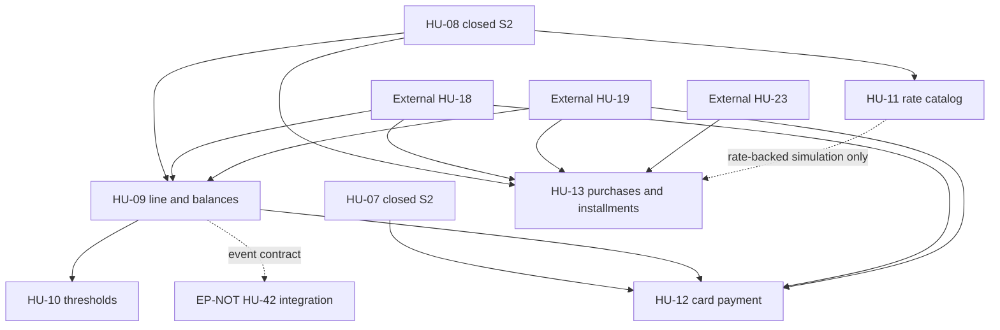

**Propagated**: 2026-09-24 — Updated from the approved Sprint 3 refinement in spec.md; Sprint 2 completion retained and HU-09..HU-13 reopened.

# Implementation Tasks: EP-CTA - Cuentas y Tarjetas

**Feature Branch**: `002-ep-cta-cuentas-tarjetas`
**Date**: 2026-09-24
**Spec**: [spec.md](spec.md) | **Plan**: [plan.md](plan.md) | **Data Model**: [data-model.md](data-model.md)
**Sprint 3 Status**: 91/91 tasks completed (2026-10-06). Existing device and suite evidence remains historical; correction #21 requires its own current verification evidence.

## Phase 1: Setup (Shared Infrastructure)

**Purpose**: Project initialization, baseline recovery, and shared configuration

- [X] T001 Recover and verify Supabase financial baseline migrations in `supabase/migrations/`
- [X] T002 [P] Configure Room schema export location and test dependencies in `app/build.gradle.kts`
- [X] T003 [P] Setup design system tokens and typography helpers for Andean Modernist in `app/src/main/java/com/kipu/app/ui/theme/Type.kt`

---

## Phase 2: Foundational (Blocking Prerequisites)

**Purpose**: Core infrastructure and pure financial models that MUST be complete before ANY user story can be implemented

**⚠️ CRITICAL**: No user story work can begin until this phase is complete

- [X] T004 Implement pure financial domain models (`Money`, `Currency`, `FinancialIds`) in `app/src/main/java/com/kipu/app/core/finance/domain/model/Money.kt`
- [X] T005 [P] Implement `Movement` domain models and enum kinds in `app/src/main/java/com/kipu/app/core/finance/domain/model/Movement.kt`
- [X] T006 [P] Implement `MoneyText` Compose component with masking and tabular numbers in `app/src/main/java/com/kipu/app/ui/component/MoneyText.kt`
- [X] T007 [P] Implement `MaskedCardReference` Compose component with PAN/CVV isolation in `app/src/main/java/com/kipu/app/ui/component/MaskedCardReference.kt`
- [X] T008 Implement `RoomMigrations` for Room v2 to v3 in `app/src/main/java/com/kipu/app/core/database/RoomMigrations.kt`
- [X] T009 Update `KipuDatabase` and converters for Room v3 in `app/src/main/java/com/kipu/app/core/database/KipuDatabase.kt`
- [X] T010 [P] Implement `PendingChangesSource` multibinding in `app/src/main/java/com/kipu/app/core/session/PendingChangesSource.kt`
- [X] T011 [P] Create PostgreSQL baseline migration and RLS helper functions in `supabase/migrations/20260921000000_ep_cta_baseline.sql`
- [X] T012 Implement `InstrumentSyncOutboxEntity` and `InstrumentSyncDao` in `app/src/main/java/com/kipu/app/feature/accounts/data/local/InstrumentSyncDao.kt`
- [X] T013 Implement `SyncInstrumentCommandsWorker` and `InstrumentSyncScheduler` in `app/src/main/java/com/kipu/app/feature/accounts/data/sync/SyncInstrumentCommandsWorker.kt`
- [X] T014 Implement `FinancialInstrumentsApi` and DTO mappers in `app/src/main/java/com/kipu/app/feature/accounts/data/remote/FinancialInstrumentsApi.kt`

**Checkpoint**: Foundation ready — user story implementation can now begin in parallel

---

## Phase 3: User Story 1 - HU-07 Administrar activos liquidos (Priority: P1) 🎯 MVP

**Goal**: Create, view, edit visual presentation, and archive liquid accounts (cash, savings, bank, digital wallets) with atomic opening movements, Free plan quota enforcement, and local-first sync.

**Independent Test**: Create accounts of each type and currency, verify opening movements, edit appearance without changing balances, archive an account, and confirm balances reproduce offline and after restart.

### Tests for User Story 1

- [X] T015 [P] [US1] Unit tests for `CreateLiquidAccount`, `RecordOpeningAdjustment`, and Free quota in `app/src/test/java/com/kipu/app/feature/accounts/domain/CreateLiquidAccountTest.kt`
- [X] T016 [P] [US1] Instrumented tests for `AccountDao` and `FinancialMovementDao` atomic transactions in `app/src/androidTest/java/com/kipu/app/feature/accounts/AccountDaoTest.kt`

### Implementation for User Story 1

- [X] T017 [P] [US1] Create `Account` domain model and preset definitions in `app/src/main/java/com/kipu/app/feature/accounts/domain/model/Account.kt`
- [X] T018 [P] [US1] Implement `AccountEntity` and `FinancialMovementEntity` in `app/src/main/java/com/kipu/app/feature/accounts/data/local/AccountEntity.kt`
- [X] T019 [US1] Implement `AccountDao` and `FinancialMovementDao` with atomic opening transactions in `app/src/main/java/com/kipu/app/feature/accounts/data/local/AccountDao.kt`
- [X] T020 [US1] Implement `FinancialInstrumentsRepository` account operations in `app/src/main/java/com/kipu/app/feature/accounts/data/OfflineFirstFinancialInstrumentsRepository.kt`
- [X] T021 [P] [US1] Implement Use Cases `CreateLiquidAccount`, `RecordOpeningAdjustment`, `ArchiveInstrument`, and `ReactivateInstrument` in `app/src/main/java/com/kipu/app/feature/accounts/domain/usecase/AccountUseCases.kt`
- [X] T022 [P] [US1] Implement `ObserveFinancialDashboard` and `ObserveInstruments` use cases in `app/src/main/java/com/kipu/app/feature/accounts/domain/usecase/ObserveInstrumentsUseCases.kt`
- [X] T023 [US1] Implement `AccountsViewModel` and UI state for Dashboard and Accounts management in `app/src/main/java/com/kipu/app/feature/accounts/presentation/AccountsViewModel.kt`
- [X] T024 [P] [US1] Implement Account form and preset selection in `app/src/main/java/com/kipu/app/feature/accounts/presentation/instruments/AccountFormScreen.kt`
- [X] T025 [US1] Implement Dashboard Pantalla 4 real money view in `app/src/main/java/com/kipu/app/feature/accounts/presentation/dashboard/DashboardScreen.kt`
- [X] T026 [US1] Implement PostgreSQL RPC `create_liquid_account_v1` and `record_opening_adjustment_v1` in `supabase/migrations/20260921000001_accounts_rpc.sql`
- [X] T027 [P] [US1] pgTAP test suite for account creation, adjustment, and RLS isolation in `supabase/tests/database/financial_accounts.test.sql`

**Checkpoint**: At this point, User Story 1 (Liquid Accounts) is fully functional and testable independently as an MVP.

---

## Phase 4: User Story 2 - HU-08 Registrar y vincular tarjetas (Priority: P1)

**Goal**: Register debit and credit cards with secure identification (no full PAN/CVV), link debit cards to liquid savings accounts without duplicating balances, and warn on duplicate visible identities.

**Independent Test**: Register a linked debit card, a credit card, and test prohibited PAN/CVV inputs. Verify debit mirrors account balance, credit does not increase cash, and Free quota counts two slots for debit+account.

### Tests for User Story 2

- [X] T028 [P] [US2] Unit tests for `RegisterDebitCard`, `RegisterCreditCard`, and PAN/CVV validation in `app/src/test/java/com/kipu/app/feature/accounts/domain/RegisterCardTest.kt`
- [X] T029 [P] [US2] Instrumented tests for `CardDao` linking and duplicate detection in `app/src/androidTest/java/com/kipu/app/feature/accounts/CardDaoTest.kt`

### Implementation for User Story 2

- [X] T030 [P] [US2] Create sealed `Card` (`DebitCard`, `CreditCard`) domain models in `app/src/main/java/com/kipu/app/feature/accounts/domain/model/Card.kt`
- [X] T031 [P] [US2] Implement `CardEntity` with debit FK and masked identification constraints in `app/src/main/java/com/kipu/app/feature/accounts/data/local/CardEntity.kt`
- [X] T032 [US2] Implement `CardDao` with linking verification and collision queries in `app/src/main/java/com/kipu/app/feature/accounts/data/local/CardDao.kt`
- [X] T033 [US2] Implement `RegisterDebitCard`, `RegisterCreditCard`, and `DeleteUnusedCard` in `app/src/main/java/com/kipu/app/feature/accounts/domain/usecase/CardUseCases.kt`
- [X] T034 [US2] Extend `OfflineFirstFinancialInstrumentsRepository` with card registration and linking in `app/src/main/java/com/kipu/app/feature/accounts/data/OfflineFirstFinancialInstrumentsRepository.kt`
- [X] T035 [P] [US2] Implement Card registration form with strict 4-digit input and duplicate warning in `app/src/main/java/com/kipu/app/feature/accounts/presentation/instruments/CardFormScreen.kt`
- [X] T036 [US2] Integrate debit card reference under liquid account in Dashboard in `app/src/main/java/com/kipu/app/feature/accounts/presentation/dashboard/DashboardScreen.kt`
- [X] T037 [US2] Implement PostgreSQL RPC `register_card_v1` and card RLS in `supabase/migrations/20260921000002_cards_rpc.sql`
- [X] T038 [P] [US2] pgTAP test suite for debit linking, credit isolation, and PAN/CVV omission in `supabase/tests/database/financial_cards.test.sql`

**Checkpoint**: At this point, User Stories 1 AND 2 (Sprint 2 Delivery Increment) work together and are independently testable.

---

## Sprint 3 Readiness and Canonical Database Contracts

Complete T075 and approve its evidence before any Sprint 3 production implementation. T075 blocks the Room migration, canonical database commands and HU-09..HU-13 integration tasks.

- [X] T075 [US3-US7] Validate the checked-in financial baseline with a clean reset; compare it with the linked project; inventory existing purchase/payment RPC behavior and ledger effects; document drift, RLS/grants, forward-only reconciliation and compatibility behavior; review and approve the gate evidence.
- [X] T076 [US3-US7] After T075 passes, add the next Room migration from checked-in version 10 with `personal_tea_bps`, `CreditInstallmentEntity` and `CreditPaymentAllocationEntity`, owner-composite keys, indexes, `Long` mappings and migration tests.
- [X] T079 [US5] After T075 passes, reconcile the official 2026-09-24 catalog snapshot into canonical `credit_products`: seed exactly 44 confirmed products (BCP 18, BBVA 10, Interbank 16); include source-supported purchase TEA by PEN/USD, ranges, membership costs/conditions, source references and caveats. Preserve unpublished, conflicting and pending source states without inferring values; exclude the Interbank Benefit/Blue pending candidate from the 44 confirmed products. Display the fixed as-of label; do not auto-expire by age.
- [X] T080 [US7] Implement the canonical database `register_transaction_v1` contract for confirmed `EXPENSE` / `CARD_PURCHASE`: owner and card validation, one principal recognition, exact installments, idempotency receipt and sync changes. Make `confirm_credit_purchase_v1` delegate to this path or retire it; no second `financial_movements` accounting path.
- [X] T081 [US6] Implement the canonical atomic database `allocate_credit_payment_v1` contract: validate owner, source account, card, currency, funds and debt; create one `TRANSFER` / `CARD_PAYMENT`; allocate FIFO by `due_date` with partial principal handling; apply equal asset/liability effects, receipt and sync changes. Make `pay_credit_card_v1` delegate to this path or retire it.

**Dependency gate**: T076, T079, T080 and T081 start only after T075. T053 depends on T079; T065 depends on T080; T058 depends on T081. No Sprint 3 financial production code begins if the clean-reset/reconciliation evidence fails review.

---

## Phase 5: User Story 3 - HU-09 Consultar linea y saldos de credito (Priority: P2)

**Goal**: View credit card authorized line, debt (used credit), available credit, and utilization percentage, with short month date adjustments.

**Independent Test**: Verify metrics with positive limit, zero limit, debt exceeding limit, and cut-off/due dates on days 29-31 across February and leap years.

### Tests for User Story 3

- [X] T039 [P] [US3] Unit tests for credit metrics and short-month calendar adjustment in `app/src/test/java/com/kipu/app/feature/accounts/domain/CreditMetricsTest.kt`

### Implementation for User Story 3

- [X] T040 [P] [US3] Implement credit metric calculation and date adjustment utilities in `app/src/main/java/com/kipu/app/core/finance/domain/CreditCalculations.kt`
- [X] T041 [US3] Implement `ObserveCreditCardSummary` use case in `app/src/main/java/com/kipu/app/feature/accounts/domain/usecase/ObserveCreditCardSummary.kt`
- [X] T042 [US3] Implement Credit Card summary card with separate used/available/limit display in `app/src/main/java/com/kipu/app/feature/accounts/presentation/components/CreditCardSummaryCard.kt`
- [X] T043 [US3] Integrate credit section with non-cash warning into Dashboard in `app/src/main/java/com/kipu/app/feature/accounts/presentation/dashboard/DashboardScreen.kt`

**Checkpoint**: Credit metrics and limits are clearly displayed and separated from cash assets.

---

## Phase 6: User Story 4 - HU-10 Recibir alertas de utilizacion (Priority: P3)

**Goal**: Monitor credit card utilization crossings (50%, 80%, 100%), deduplicate alerts, re-arm upon drops, and render internal warnings.

**Independent Test**: Test ascending threshold crosses, multiple threshold jumps in one transaction, deduplication while staying above threshold, and re-arming after drop.

### Tests for User Story 4

- [X] T044 [P] [US4] Unit tests for threshold crossing, deduplication, and re-arming in `app/src/test/java/com/kipu/app/feature/accounts/domain/UtilizationAlertsTest.kt`

### Implementation for User Story 4

- [X] T045 [P] [US4] Implement `ThresholdState` domain entity in `app/src/main/java/com/kipu/app/feature/accounts/domain/model/ThresholdState.kt`
- [X] T046 [US4] Implement `CheckUtilizationThresholds` from committed before/after utilization transitions with per-threshold crossing and re-arming.
- [X] T047 [US4] Implement the HU-10 producer for one event per newly crossed 50%, 80% or 100% utilization threshold, with a stable operation-derived identity and per-threshold re-arming. Emit the agreed event payload for EP-NOT/HU-42; do not own notification-center persistence or deduplication.
- [X] T048 [US4] Display active utilization alerts on Dashboard and Credit Card details by consuming them through EP-NOT/HU-42's shared `app_notifications` contract. EP-CTA does not persist notification state or create its own notifications table. Implement the presentation in `app/src/main/java/com/kipu/app/feature/accounts/presentation/dashboard/DashboardScreen.kt`.

**Checkpoint**: Credit utilization threshold alerts trigger, deduplicate, and re-arm reliably.

---

## Phase 7: User Story 5 - HU-11 Consultar catalogo y registrar TEA (Priority: P3)

**Goal**: View Peruvian bank referential interest rate catalog with disclaimers and verification dates, and manage personal TEA for credit cards without rewriting historical data.

**Independent Test**: Consult active and outdated catalog rates, verify disclaimers, save personal TEA, and verify historical simulations remain unchanged.

### Tests for User Story 5

- [X] T049 [P] [US5] Unit tests for TEA validation and catalog reference models in `app/src/test/java/com/kipu/app/feature/accounts/domain/TeaCatalogTest.kt`

### Implementation for User Story 5

- [X] T050 [P] [US5] Implement `RateReference` and `PersonalTea` domain models in `app/src/main/java/com/kipu/app/feature/accounts/domain/model/RateCatalogModels.kt`
- [X] T051 [US5] Implement `UpdatePersonalTea` and `GetReferentialRates` use cases in `app/src/main/java/com/kipu/app/feature/accounts/domain/usecase/TeaCatalogUseCases.kt`
- [X] T052 [P] [US5] Implement Rate Catalog sheet and personal TEA editor in `app/src/main/java/com/kipu/app/feature/accounts/presentation/instruments/RateCatalogScreen.kt`
- [X] T053 [US5] Implement Android catalog read-model/repository mapping from canonical `credit_products` and persist per-card `personal_tea_bps`; show source status and caveats without seeding data or creating a parallel rate catalog.
- [X] T091 [US5] Correct the card-contextual reference view: resolve the persisted card/product, restore its personal TEA, require a unique exact catalog match by product/emitter/network and show loading, error or no-reference states without guessing in `RateCatalogContext.kt`, `RateCatalogScreen.kt` and `AccountsNavigation.kt`.
- [X] T092 [US5] Apply PR #23 validation: explicit preset/catalog aliases, exclusive card/catalog states, retry error clearing and per-card restored TEA draft tests in the contextual rate view.

**Checkpoint**: Referential rates and personal TEA are manageable and isolated from historical financial records.

**Propagated**: 2026-10-06 — Updated from the #21 contextual-rate refinement in spec.md.

---

## Phase 8: User Story 6 - HU-12 Pagar una tarjeta de credito (Priority: P2)

**Goal**: Pay credit card debt from an active savings/checking account as a symmetric internal transfer reducing cash and liability without generating operational expense.

**Independent Test**: Execute payment with sufficient funds, verify both balances decrease equally, verify expense report remains unchanged, and verify overpayment rejection.

### Tests for User Story 6

- [X] T054 [P] [US6] Unit tests for amortizing payment invariants and overpayment rejection in `app/src/test/java/com/kipu/app/feature/accounts/domain/PayCreditCardTest.kt`

### Implementation for User Story 6

- [X] T055 [US6] Implement `PayCreditCard` through one canonical atomic TRANSFER/CARD_PAYMENT command and allocation repository operation.
- [X] T056 [US6] Extend local repository/projections for credit-payment allocations and liability updates without a second expense/movement accounting path.
- [X] T057 [P] [US6] Implement Card payment dialog with source account picker and debt validation in `app/src/main/java/com/kipu/app/feature/accounts/presentation/instruments/PayCardDialog.kt`
- [X] T058 [US6] Integrate Android `PayCreditCard`, repository, outbox and response mapping with the canonical `allocate_credit_payment_v1` contract from T081. Send the stable operation ID and minor-unit amount; do not call the movement-only payment RPC or post a second local accounting effect.
- [X] T059 [P] [US6] pgTAP test suite for card payment non-expense invariant and idempotency in `supabase/tests/database/financial_payment.test.sql`

**Checkpoint**: Card debt payments amortize liabilities symmetrically without affecting expense metrics.

---

## Phase 9: User Story 7 - HU-13 Registrar compras y simular cuotas (Priority: P2)

**Goal**: Confirm credit purchases with single principal recognition as debt and expense, and simulate 1-36 installments with deterministic cent distribution without booking simulated interest as real debt.

**Independent Test**: Confirm purchase candidate, simulate 1-36 installments, verify exact cent sum equality with total, and verify simulated interest is not booked as debt.

### Tests for User Story 7

- [X] T060 [P] [US7] Add deterministic/property-based installment tests using amounts from S/ 0.01 through S/ 100,000.00 and every installment count from 1 to 36. Include both endpoints, representative values with different cent remainders, exact schedule sums, the remainder assigned to installment 1, and no accounting postings for estimates (SC-010) in `app/src/test/java/com/kipu/app/feature/accounts/domain/InstallmentSimulationTest.kt`

### Implementation for User Story 7

- [X] T061 [P] [US7] Implement `PurchaseCandidate` and `InstallmentSimulation` models in `app/src/main/java/com/kipu/app/feature/accounts/domain/model/InstallmentModels.kt`
- [X] T062 [US7] Implement `SimulateInstallments` as a pure domain use case using the approved French fixed-payment calculation and TEA/TEM conversion. Return the estimate, total interest, installment amounts and card-cycle due dates using Long minor units; assign any rounding remainder to installment 1. Estimates must not post accounting entries.
- [X] T063 [US7] Implement `ConfirmCreditPurchase` use case in `app/src/main/java/com/kipu/app/feature/accounts/domain/usecase/ConfirmCreditPurchase.kt`
- [X] T064 [P] [US7] Implement Purchase confirmation and Installment simulator sheet in `app/src/main/java/com/kipu/app/feature/accounts/presentation/instruments/InstallmentSimulatorScreen.kt`
- [X] T065 [US7] Integrate Android `ConfirmCreditPurchase`, repository, outbox and response mapping with the canonical `register_transaction_v1` contract from T080. Keep a detected purchase financially inert until explicit confirmation; do not call the movement-only purchase RPC.
- [X] T066 [P] [US7] pgTAP test suite for purchase confirmation and cent rounding in `supabase/tests/database/financial_purchase.test.sql`

**Checkpoint**: Credit purchases and installment plans function with exact cent arithmetic and unconfirmed interest protection.

---

## Phase 10: Polish & Cross-Cutting Concerns

**Purpose**: Improvements, navigation integration, dependency injection, and end-to-end verification

- [X] T067 [P] Implement navigation routes and arguments validation in `app/src/main/java/com/kipu/app/navigation/AccountsNavigation.kt`
- [X] T068 Integrate Accounts and Dashboard navigation into `app/src/main/java/com/kipu/app/navigation/KipuNavHost.kt`
- [X] T069 Configure Hilt dependency injection bindings in `app/src/main/java/com/kipu/app/feature/accounts/di/AccountsModule.kt`
- [X] T070 [P] Architecture boundary test ensuring domain independence from frameworks in `app/src/test/java/com/kipu/app/feature/accounts/ArchitectureBoundaryTest.kt`
- [X] T071 End-to-end verification and run quickstart scenarios per `specs/002-ep-cta-cuentas-tarjetas/quickstart.md`

---

## Dependencies & Execution Order

### Phase Dependencies

- **Setup (Phase 1)**: No dependencies — can start immediately.
- **Foundational (Phase 2)**: Depends on Setup completion — BLOCKS all user stories.
- **User Story 1 (Phase 3 - P1)**: Depends on Foundational completion.
- **User Story 2 (Phase 4 - P1)**: Depends on Foundational completion and integrates with User Story 1 (linking debit cards to liquid accounts).
- **Sprint 3 readiness**: T075 must pass before T076, T080, T081 and all HU-09..HU-13 production integration. Existing Sprint 2/external acceptance suites remain prerequisite gates for their dependent stories.
- **User Story 3 / HU-09 (Phase 5 - P2)**: Depends on completed HU-08 and external HU-18/HU-19; validate these prerequisites before implementation.
- **User Story 4 / HU-10 (Phase 6 - P3)**: Depends on HU-09; event delivery partially integrates with EP-NOT/HU-42.
- **User Story 5 / HU-11 (Phase 7 - P3)**: Depends on completed HU-08, T075 and T079; its rate data is a partial input to HU-13 simulation. The dated catalog snapshot has no age-based automatic expiration.
- **User Story 6 / HU-12 (Phase 8 - P2)**: Depends on completed HU-07, HU-09 and external HU-18/HU-19; T058 integrates the canonical T081 contract.
- **User Story 7 / HU-13 (Phase 9 - P2)**: Depends on completed HU-08, external HU-18/HU-19/HU-23 and T075; HU-11 is partial for rate-backed estimates; T065 integrates the canonical T080 contract.
- **Polish (Phase 10)**: Depends on completion of desired user story increment.

### User Story Dependencies

HU-07, HU-08, HU-18, HU-19 and HU-23 are prerequisites from closed/other increments, not scope added to these Sprint 3 stories. HU-42 is a partial integration for threshold events; its notification-center delivery does not block HU-10 domain planning.

---

## Parallel Opportunities

- **Parallel after prerequisite checks**: HU-09 domain/projection tasks and HU-11 catalog tasks can proceed in separate files after HU-08/HU-18/HU-19 are green. HU-13's no-interest principal schedule can be designed in parallel; rate selection/simulation integration waits for HU-11.
- **Parallel integration preparation**: HU-10 threshold producer/event schema can be prepared alongside EP-NOT HU-42, provided both agree on the stable event ID and `app_notifications` receiver contract. Neither epic edits the other's spec or shared contract concurrently.
- **Parallel validation authoring**: Unit tests, Room migration tests, UI tests and pgTAP tests can be authored in separate files after the corresponding canonical data/API contracts are approved.
- **SEQUENTIAL**: T075 precedes all Sprint 3 production implementation; T076 precedes local Room integrations; T080 precedes T065; T081 precedes T058. HU-09 precedes HU-10 and HU-12; HU-12 also requires HU-07/HU-18/HU-19. HU-13 requires HU-08/HU-18/HU-19/HU-23; its optional/reference-rate path waits for HU-11.
- **Validation sequence**: T088 follows the Card Preview, purchase and payment UI work in T084; final gate T087 follows T088.

---

## Implementation Strategy

### MVP First (Sprint 2 Delivery Increment: User Story 1 + User Story 2)

1. Complete **Phase 1: Setup** (T001–T003).
2. Complete **Phase 2: Foundational** (T004–T014).
3. Complete **Phase 3: User Story 1 (Liquid Accounts)** (T015–T027).
4. **STOP and VALIDATE**: Verify account creation, opening movements, balance recalculation, and offline persistence.
5. Complete **Phase 4: User Story 2 (Cards & Debit Link)** (T028–T038).
6. **STOP and VALIDATE**: Verify debit card linking to savings accounts without balance duplication, credit card registration without cash addition, and PAN/CVV rejection.
7. Complete **Phase 10: Polish** for Sprint 2 increment.

### Incremental Evolution (Sprint 3: User Stories 3–7)

0. Complete and approve **T075 (baseline and RPC reconciliation)**; complete T076 before adding local S3 persistence.
1. Start with **HU-09 (Credit Line & Balances)** after confirming HU-08/HU-18/HU-19.
2. In parallel, prepare **HU-11 (Catalog & Personal TEA)** and HU-13's no-interest purchase contract after HU-08 is green.
3. Continue **HU-10 (Threshold Events)** after HU-09; agree its event contract with EP-NOT/HU-42.
4. Continue **HU-12 (Card Payment)** after HU-07/HU-09/HU-18/HU-19.
5. Complete **HU-13 (Credit Purchases & Installments)** after HU-08/HU-18/HU-19/HU-23; connect its rate-backed estimates to HU-11.
6. Preserve one ledger path, retry idempotency and all Sprint 1/Sprint 2 history.

---

## Phase 11: Convergence

**Purpose**: Close remaining gaps identified against updated data-model.md, sync-contract.md, and quickstart.md

- [X] T072 Validate 100 deterministic PAN/CVV rejection attempts across card-registration use cases and UI inputs, including alias and issuer. Assert rejected values are not persisted, synchronized, or rendered, per RF-C05, SC-005 and quickstart.md.
- [X] T073 Include archived account balances in real money totals (totalPen, totalUsd) in ObserveFinancialDashboard while filtering active list per data-model.md:L353 and quickstart.md:L116
- [X] T074 Populate predecessor_operation_id in outbox command creation to enforce causal chaining per sync-contract.md:L44

## Phase 12: Sprint 3 Cross-Cutting Integration and Validation

These tasks complete only HU-09..HU-13 and their explicitly required integration contracts. They remain unchecked until implementation begins. T075, T076, T079, T080 and T081 are listed in the Sprint 3 readiness/canonical-contract section above.

- [X] T077 [P] [US3-US7] Add cross-cutting unit tests for short-month closing and due dates with preferred days 29, 30 and 31, and for deterministic minor-unit rounding, including installment counts 1 and 36, non-divisible amounts and remainder assignment to installment 1. Exercise the T062 outputs; do not duplicate the French calculation implementation.
- [X] T078 [US3] Derive credit used/available/utilization from confirmed liability effects and persist/display line changes without truncating existing debt.
- [X] T083 [US4] Integrate the T047 event with EP-NOT/HU-42 through the agreed `app_notifications` contract. Verify receiver-side deduplication, retry idempotency and end-to-end delivery; do not reimplement the HU-10 producer or add a notification table.
- [X] T084 [US3-US7] Integrate credit summary, catalog/threshold presentation, ViewModels, routes, dependency injection and screens; preserve Screen 4/5 Card Preview and PEN/S/ UI contracts. T058 and T065 own payment/purchase repository, outbox and command dispatch.
- [X] T085 [US3-US7] Add end-to-end/domain/Room/Compose/worker tests for credit separation, S/100 in 3 installments, cycle dates, French simulation without postings, payment without expense, retry, threshold dedupe/re-arm and rejected unconfirmed purchase.
- [X] T086 [US3-US7] Add cross-cutting pgTAP coverage for ownership/RLS, cross-user rejection, operation collisions/retries, concurrency, rollback and legacy RPC compatibility. T059 and T066 retain the payment- and purchase-specific accounting assertions. Evidence (2026-09-25): user confirms Sprint 3 behavior was directly verified on Galaxy S24+ (SM-S926B, API 36); the local pgTAP suite passed 319/319 assertions, alongside the ownership, retry/collision and compatibility coverage.
- [X] T088 [P] [US3-US7] Validate with TalkBack and Compose accessibility semantics the simulated physical-card/Card Preview, installment-purchase screen and debt-amortization flow. Verify traversal order; labels, roles, values, currency, due dates, warnings and states; announced validation/confirmation/cancellation; and operability without color-only cues. Evidence: 2026-09-25, Samsung Galaxy S24+ (SM-S926B, API 36); `CreditAccessibilitySemanticsTest` 3/3 passed with TalkBack enabled, checking card semantics, purchase amount/due dates/disclaimer and adjustable installment selector, semantic reading order, confirmation/rejection actions, payment amount/source/debt/warning, invalid-amount announcement and cancellation; final `connectedLabAndroidTest` 125/125 passed. Device accessibility settings restored to their prior `null/0/0` state.
- [X] T087 [US3-US7] After T088, run the quickstart gates, clean Supabase reset/database tests, Android build/lint/unit/instrumented suites, and Sprint 1/Sprint 2 ledger and UI regression. Include (a) a deterministic 100-case accounting-replay matrix covering account creation/correction/archive, card linkage, purchases, payments, reversals and retries, comparing reproduced balances with auditable ledger effects to the cent (SC-002); and (b) 100 deterministic combined offline, close/restart, retry, delayed or reordered sync, and reconnect sequences, verifying every confirmed operation is preserved once with no duplicate financial effects (SC-011). Attach green evidence before closure. Evidence (2026-09-25): user confirms direct live verification of the Sprint 3 app flows on Galaxy S24+ (SM-S926B, API 36); 234/234 Android unit tests, 125/125 connected instrumented tests on SM-S926B/API 36, and 319/319 local pgTAP assertions passed; build and lint are green. User confirmed the requested validation is complete.

## Phase 13: Convergence

Convergence review (2026-09-26): the user directly verified accounting, synchronization, and credit flows on Galaxy S24+ (SM-S926B, API 36), and reported all 234 unit tests, 125 instrumented tests, and 319 local pgTAP tests passing. Based on that verification, all three convergence validation tasks are complete; total is 90 tasks, 90 complete and 0 open.

- [X] T089 [US1-US7] Add and run a deterministic 100-case accounting-replay matrix for account creation/correction/archive, card linkage, purchases, payments, reversals and retries; compare reproduced balances with auditable ledger effects to the cent [HIGH] per SC-002. Evidence: user directly verified accounting flows on Galaxy S24+ (SM-S926B, API 36); user reports 234/234 unit, 125/125 instrumented, and 319/319 local pgTAP tests green.
- [X] T090 [US1-US7] Add and run 100 deterministic offline, close/restart, retry, delayed or reordered sync, and reconnect sequences; assert every confirmed operation is preserved exactly once with no duplicate financial effects [HIGH] per SC-011. Evidence: user directly verified synchronization flows on Galaxy S24+ (SM-S926B, API 36); user reports 234/234 unit, 125/125 instrumented, and 319/319 local pgTAP tests green.
- [X] T091 [US3-US7] Add two-session concurrent execution and forced-failure rollback tests for `register_transaction_v1`, `allocate_credit_payment_v1` and their legacy adapters; assert a single receipt/effect under races and no partial transaction, ledger, installment, allocation or receipt writes after failure [HIGH] per T086 and plan: database reliability. Evidence: user directly verified credit flows on Galaxy S24+ (SM-S926B, API 36); user reports 234/234 unit, 125/125 instrumented, and 319/319 local pgTAP tests green.
